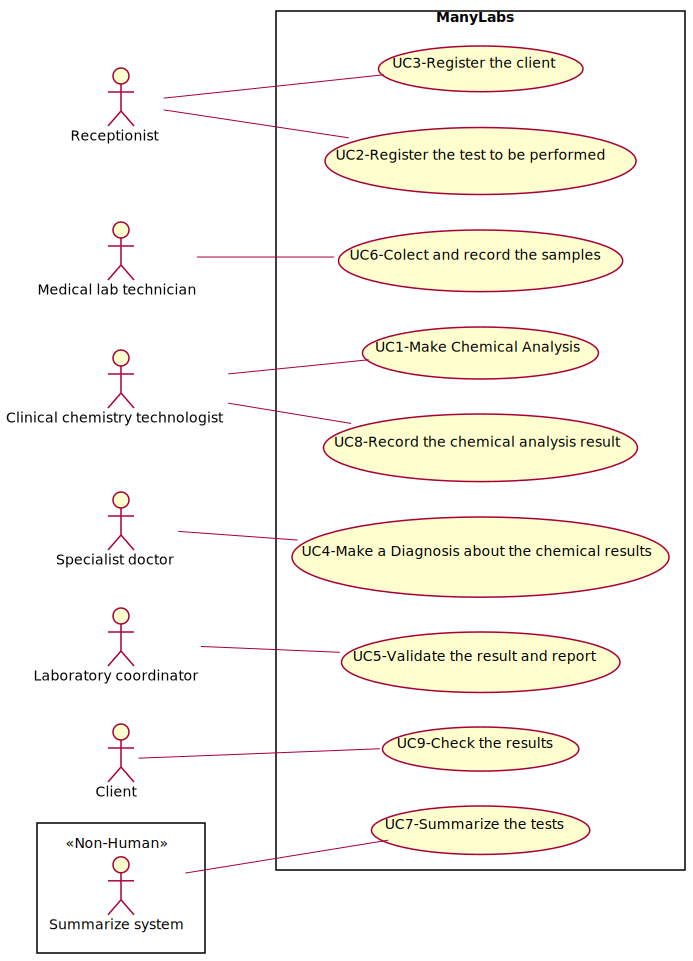

# Use Case Diagram (UCD)

**In the scope of this project, there is a direct relationship of _1 to 1_ between Use Cases (UC) and User Stories (US).**

However, be aware, this is a pedagogical simplification. On further projects and curricular units might also exist _1 to N **and/or** N to 1 relationships between US and UC.

**Insert below the Use Case Diagram in a SVG format**

**For each UC/US, it must be provided evidences of applying main activities of the software development process (requirements, analysis, design, tests and code). Gather those evidences on a separate file for each UC/US and set up a link as suggested below.**

# Use Cases / User Stories
| UC/US  | Description                                                               |                   
|:----|:------------------------------------------------------------------------|
| UC1 | Make Chemical Analysis(UC1.md)   |
| UC2 | Register the test to be performed(UC2.md)  |
| UC3 | Register the client(UC3.md)|
| UC4 | Make a Diagnosis about the chemical results(UC4.md)|
| UC5 | Validate the result and report(UC5.md)|
| UC6 | Colect and record the samples(UC6.md)|
| UC7 | Summarize the tests(UC7.md)|
| UC8 | Record the chemical analysis result(UC8.md)|
| UC9 | Check the results(UC9.md)|

