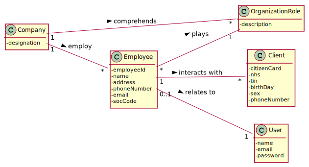
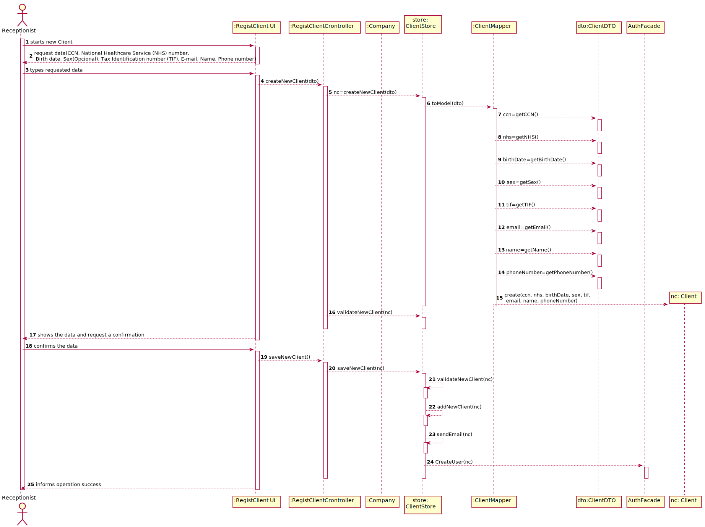
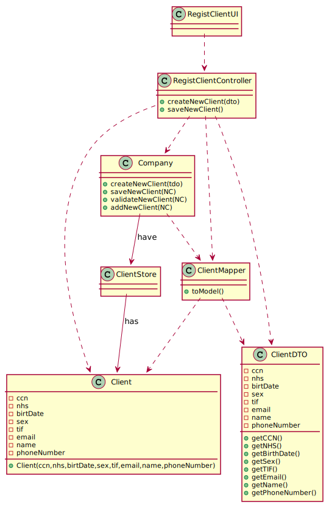

# US 003 - To register a client  

## 1. Requirements Engineering

### 1.1. User Story Description

As a receptionist of the laboratory, I want to register a client.

### 1.2. Customer Specifications and Clarifications 

**From the specifications document:**

> "In case of a new client, the receptionist registers the client in the application. To register a client, the receptionist needs the client’s citizen card number, National Healthcare Service (NHS) number, birth date, sex, Tax Identification number (TIF), phone number, e-mail and name."

**From the client clarifications:**

> **Question:** "After being registered by the receptionist, should the client receive some kind of confirmation e-mail in order to finish his registration?"
>  
> **Answer:** "The client only receives an e-mail informing that the registration was successful and that he can start to use the system. The e-mail includes the client password." - [link: https://moodle.isep.ipp.pt/mod/forum/discuss.php?d=7736#p10133]

> **Question:**  "The receptionist needs mandatorily of all client data described on the project description?"
>  
> **Answer:**  "The sex is opcional. All other fields are required." - [link: https://moodle.isep.ipp.pt/mod/forum/discuss.php?d=7563#p10179] 

> **Question:**  "To register a Client which is the format of each attribute?"
>  
> **Answer:**  "Citizen Card: 16 digit number
				NHS: 10 digit number
				TIN: 10 digit number
				Birth day - in which format: DD/MM/YY
				Sex - should only be Male/Female or include more options. Male/Female
				Phone number: 11 digit number" - [link: https://moodle.isep.ipp.pt/mod/forum/discuss.php?d=7563#p10179]

> **Question:** "Does the receptionist need to be logged in the app to preform the regist?"
>  
> **Answer:** "Yes" - [link: https://moodle.isep.ipp.pt/mod/forum/discuss.php?d=7462#p9872]

> **Question:** "What parameter (asked by the receptionist) should the system use to create the password of the new client"
>  
> **Answer:** "The password should be randomly generated. It should have ten alphanumeric characters." - [link: https://moodle.isep.ipp.pt/mod/forum/discuss.php?d=7462#p9872]

> **Question:** "How should the system send a email to the client with the password"
>  
> **Answer:** "Considering a set of technical restrictions, during the development of the Integrative Project we will not use any e-mail or SMS API services to send messages. All the e-mail and SMS messages should be written to a file with the name emailAndSMSMessages.txt. This file simulates the use of e-mail and SMS API services." - [link: https://moodle.isep.ipp.pt/mod/forum/discuss.php?d=7808#p10545]

> **Question:** "Does the client need to tell his age to the recepcionis. Im asking because before you didnt especified that that would be a parameter?"
>  
> **Answer:** "No, only needs to tell the birth day (from a previous post). The application must validate and should not accept clients who have more than 150 years of age" - [link: https://moodle.isep.ipp.pt/mod/forum/discuss.php?d=7954#p10405]

> **Question:** "What should be the maximum length of the String with the name of the Client?"
>  
> **Answer:** "A string with no more than 35 characters." - [link: https://moodle.isep.ipp.pt/mod/forum/discuss.php?d=7945#p10383]

### 1.3. Acceptance Criteria

* **AC1:** All required fiels must be filled in, except the phone number.
* **AC2:** The client must become a system user.
* **AC3:** The "auth" component available on the repository must be reused (without modifications)
* **AC4** Citizen Card: 16 digit number
* **AC5** NHS: 10 digit number
* **AC6** TIN: 10 digit number
* **AC7** Birth day - in which format: DD/MM/YY
* **AC8** Sex - should only be Male/Female or include more options. Male/Female
* **AC9** Phone number: 11 digit number"
* **AC10** The user cant be older than 150 years
* **AC11** The name cant be longer than 35 characters
* **AC12** The password should be random generated

### 1.4. Found out Dependencies

* There is no dependency found.

### 1.5 Input and Output Data

**Input Data:**

* Typed data: Citizen card number, National Healthcare Service (NHS) number, Birth date, Sex(Opcional), Tax Identification number (TIN), E-mail, Name, Phone number
	

**Output Data:**

* (In)Success of the operation

### 1.6. System Sequence Diagram (SSD)

**Alternative 1**

### 1.7 Other Relevant Remarks

* The created task stays in a "not published" state in order to distinguish from "published" tasks.

## 2. OO Analysis

### 2.1. Relevant Domain Model Excerpt 

### 2.2. Other Remarks

n/a

## 3. Design - User Story Realization 

### 3.1. Rationale

**SSD - Alternative 1 is adopted.**

| Interaction ID | Question: Which class is responsible for... | Answer  | Justification (with patterns)  |
|:-------------  |:--------------------- |:------------|:---------------------------- |
| Step 1  		 |	... interacting with the actor? | CreateTaskUI   |  Pure Fabrication: there is no reason to assign this responsibility to any existing class in the Domain Model.           |
| 			  		 |	... coordinating the US? | CreateTaskController | Controller                             |
| 			  		 |	... instantiating a new Task? | Organization   | Creator (Rule 1): in the DM Organization has a Task.   |
| 			  		 | ... knowing the user using the system?  | UserSession  | IE: cf. A&A component documentation.  |
| 			  		 |	... knowing to which organization the user belongs to? | Platform  | IE: has registed all Organizations |
| 			  		 |							 | Organization   | IE: knows/has its own Employees|
| 			  		 |							 | Employee  | IE: knows its own data (e.g. email) |
| Step 2  		 |							 |             |                              |
| Step 3  		 |	...saving the inputted data? | Task  | IE: object created in step 1 has its own data.  |
| Step 4  		 |	...knowing the task categories to show? | Platform  | IE: Task Categories are defined by the Platform. |
| Step 5  		 |	... saving the selected category? | Task  | IE: object created in step 1 is classified in one Category.  |
| Step 6  		 |							 |             |                              |              
| Step 7  		 |	... validating all data (local validation)? | Task | IE: owns its data.| 
| 			  		 |	... validating all data (global validation)? | Organization | IE: knows all its tasks.| 
| 			  		 |	... saving the created task? | Organization | IE: owns all its tasks.| 
| Step 8  		 |	... informing operation success?| CreateTaskUI  | IE: is responsible for user interactions.  | 

### Systematization ##

According to the taken rationale, the conceptual classes promoted to software classes are: 

 * Organization
 * Platform
 * Task

Other software classes (i.e. Pure Fabrication) identified: 

 * CreateTaskUI  
 * CreateTaskController

## 3.2. Sequence Diagram (SD)

**Alternative 1**

## 3.3. Class Diagram (CD)

**From alternative 1**

# 4. Tests 

**Test 1:** Check that it is not possible to create an instance of the Task class with null values. 

	@Test(expected = IllegalArgumentException.class)
		public void ensureNullIsNotAllowed() {
		Task instance = new Task(null, null, null, null, null, null, null);
	}
	

**Test 2:** Check that it is not possible to create an instance of the Task class with a reference containing less than five chars - AC2. 

	@Test(expected = IllegalArgumentException.class)
		public void ensureReferenceMeetsAC2() {
		Category cat = new Category(10, "Category 10");
		
		Task instance = new Task("Ab1", "Task Description", "Informal Data", "Technical Data", 3, 3780, cat);
	}

*It is also recommended to organize this content by subsections.* 

# 5. Construction (Implementation)

## Class CreateTaskController 

		public boolean createTask(String ref, String designation, String informalDesc, 
			String technicalDesc, Integer duration, Double cost, Integer catId)() {
		
			Category cat = this.platform.getCategoryById(catId);
			
			Organization org;
			// ... (omitted)
			
			this.task = org.createTask(ref, designation, informalDesc, technicalDesc, duration, cost, cat);
			
			return (this.task != null);
		}

## Class Organization

		public Task createTask(String ref, String designation, String informalDesc, 
			String technicalDesc, Integer duration, Double cost, Category cat)() {
		
	
			Task task = new Task(ref, designation, informalDesc, technicalDesc, duration, cost, cat);
			if (this.validateTask(task))
				return task;
			return null;
		}

# 6. Integration and Demo 

* A new option on the Employee menu options was added.

* Some demo purposes some tasks are bootstrapped while system starts.

# 7. Observations

Platform and Organization classes are getting too many responsibilities due to IE pattern and, therefore, they are becoming huge and harder to maintain. 

Is there any way to avoid this to happen?

