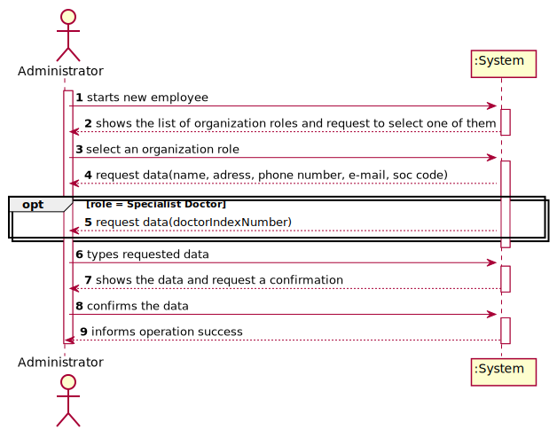

# US 007 - To resgister a new Employee 

## 1. Requirements Engineering

### 1.1. User Story Description

As an administrator, I want to resgister a new employee.

### 1.2. Customer Specifications and Clarifications 

**From the specifications document:**

**From the client clarifications:**

> **Question:** Which attributes a employee have?
>  
> **Answer:** Employee ID, Organization Role, Name, Address, Phone Number, E-Mail, Standard Occupational Classification (SOC) code.
>
> **Question:** "When creating a new employee, the attributes 'Employee ID' and 'Doctor Index Number', are implemented by the administrator or incremented by the system?" - [link: https://moodle.isep.ipp.pt/mod/forum/discuss.php?d=7547#p10159]
>
> **Answer:** Only the employee ID should be generated. The Doctor Index Number should be introduced by the administrator.
>
> **Question:** "Regarding the registration of a new employee, which is the organization role's format?" - [link: https://moodle.isep.ipp.pt/mod/forum/discuss.php?d=7928#p10353]
> 
> **Answer:**
> 
> **Question:** When the application is delivered, should it have default employees, ex:administrator, or should be completly empty (without any user or employee)? - [link: https://moodle.isep.ipp.pt/mod/forum/discuss.php?d=7668#p9993]
> 
> **Answer:** "One Administrator must be registered before starting the application for the first time."
> 
> **Question:** "Are there any other employee roles than the ones specified in the documents?" - [link: https://moodle.isep.ipp.pt/mod/forum/discuss.php?d=7738#p10084]
> 
> **Answer:** "No."

### 1.3. Acceptance Criteria

* **AC1:** "Each user must have a single role defined in the system."
* **AC2:** "The "auth" component available on the repository must be reused (without modifications)."
* **AC3:** "The employee ID should be generated from the initials of the employee name and should include a number. The number has 5 digits and is increases automatically when a new employee is registered in the system."

### 1.4. Found out Dependencies

* 

### 1.5 Input and Output Data

**Input Data:**

* Typed data:
	* a name,
	* an adress,
	* a phone number,
	* an e-mail,
	* an standard occupational classification code.
	
* Selected data:
	* Organization role.
	
* Generated data:
	* EmployeeID

**Output Data:**

* (In)Success of the operation

### 1.6. System Sequence Diagram (SSD)

**Alternative 1**

**Alternative 2**

**Other alternatives might exist.**

### 1.7 Other Relevant Remarks

* The created task stays in a "not published" state in order to distinguish from "published" tasks.

## 2. OO Analysis

### 2.1. Relevant Domain Model Excerpt 

### 2.2. Other Remarks

n/a

## 3. Design - User Story Realization 

### 3.1. Rationale

**SSD - Alternative 1 is adopted.**

| Interaction ID | Question: Which class is responsible for... | Answer  | Justification (with patterns)  |
|:-------------  |:--------------------- |:------------|:---------------------------- |
| Step 1  		 |	... interacting with the actor? | CreateTaskUI   |  Pure Fabrication: there is no reason to assign this responsibility to any existing class in the Domain Model.           |
| 			  		 |	... coordinating the US? | CreateTaskController | Controller                             |
| 			  		 |	... instantiating a new Task? | Organization   | Creator (Rule 1): in the DM Organization has a Task.   |
| 			  		 | ... knowing the user using the system?  | UserSession  | IE: cf. A&A component documentation.  |
| 			  		 |	... knowing to which organization the user belongs to? | Platform  | IE: has registed all Organizations |
| 			  		 |							 | Organization   | IE: knows/has its own Employees|
| 			  		 |							 | Employee  | IE: knows its own data (e.g. email) |
| Step 2  		 |							 |             |                              |
| Step 3  		 |	...saving the inputted data? | Task  | IE: object created in step 1 has its own data.  |
| Step 4  		 |	...knowing the task categories to show? | Platform  | IE: Task Categories are defined by the Platform. |
| Step 5  		 |	... saving the selected category? | Task  | IE: object created in step 1 is classified in one Category.  |
| Step 6  		 |							 |             |                              |              
| Step 7  		 |	... validating all data (local validation)? | Task | IE: owns its data.| 
| 			  		 |	... validating all data (global validation)? | Organization | IE: knows all its tasks.| 
| 			  		 |	... saving the created task? | Organization | IE: owns all its tasks.| 
| Step 8  		 |	... informing operation success?| CreateTaskUI  | IE: is responsible for user interactions.  | 

### Systematization ##

According to the taken rationale, the conceptual classes promoted to software classes are: 

 * Organization
 * Platform
 * Task

Other software classes (i.e. Pure Fabrication) identified: 

 * CreateTaskUI  
 * CreateTaskController

## 3.2. Sequence Diagram (SD)

**Alternative 1**

**Alternative 2**

## 3.3. Class Diagram (CD)

**From alternative 1**

# 4. Tests 

**Test 1:** Check that it is not possible to create an instance of the Task class with null values. 

	@Test(expected = IllegalArgumentException.class)
		public void ensureNullIsNotAllowed() {
		Task instance = new Task(null, null, null, null, null, null, null);
	}
	

**Test 2:** Check that it is not possible to create an instance of the Task class with a reference containing less than five chars - AC2. 

	@Test(expected = IllegalArgumentException.class)
		public void ensureReferenceMeetsAC2() {
		Category cat = new Category(10, "Category 10");
		
		Task instance = new Task("Ab1", "Task Description", "Informal Data", "Technical Data", 3, 3780, cat);
	}

*It is also recommended to organize this content by subsections.* 

# 5. Construction (Implementation)

## Class CreateTaskController 

		public boolean createTask(String ref, String designation, String informalDesc, 
			String technicalDesc, Integer duration, Double cost, Integer catId)() {
		
			Category cat = this.platform.getCategoryById(catId);
			
			Organization org;
			// ... (omitted)
			
			this.task = org.createTask(ref, designation, informalDesc, technicalDesc, duration, cost, cat);
			
			return (this.task != null);
		}

## Class Organization

		public Task createTask(String ref, String designation, String informalDesc, 
			String technicalDesc, Integer duration, Double cost, Category cat)() {
		
	
			Task task = new Task(ref, designation, informalDesc, technicalDesc, duration, cost, cat);
			if (this.validateTask(task))
				return task;
			return null;
		}

# 6. Integration and Demo 

* A new option on the Employee menu options was added.

* Some demo purposes some tasks are bootstrapped while system starts.

# 7. Observations

Platform and Organization classes are getting too many responsibilities due to IE pattern and, therefore, they are becoming huge and harder to maintain. 

Is there any way to avoid this to happen?

