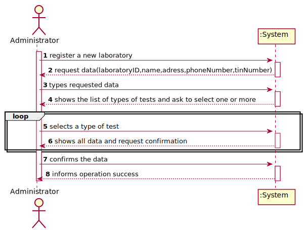

# US 008 - To register a new Laboratory 

## 1. Requirements Engineering

### 1.1. User Story Description

As an administrator, I want to register a new Clinical Analysis Laboratory.

### 1.2. Customer Specifications and Clarifications 

**From the specifications document:**

>	Each task is characterized by having a unique reference per organization, a designation, an informal and a technical description, an estimated duration and cost as well as the its classifying task category. 

>	As long as it is not published, access to the task is exclusive to the employees of the respective organization. 

**From the client clarifications:**

> **Question:** Does the administrator need to be logged in to register a new Clinical Analysis Laboratory?
>  
> **Answer:** 

-

> **Question:** Is there a maximum limit of types of tests a clinical analysis laboratory can operate?
>  
> **Answer:** No.

-

> **Question:** When starting a new clinical analysis laboratory registration, should the entered requested data be showed to the user for confirmation purposes?
>  
> **Answer:** It is always a good practice to validate and ask for confirmation.

-

> **Question:** When the administrator is registering a Clinical Analysis Laboratory and typing the information does he type the laboratory ID or is it generated by the system afterwards?
>  
> **Answer:** The Laboratory ID is introduced manually.

### 1.3. Acceptance Criteria

* **AC1:** Every Clinical Analysis Laboratory must perform blood tests.
* **AC2:** The laboratoryID has 5 alphanumeric characters.
* **AC3:** The name must have no more than 20 characters.
* **AC4:** The address must have no more than 20 characters.
* **AC5:** The phone number is an 11-digit number.
* **AC6:** TIN is a 10-digit number.
* **AC7:** Every field is required.
* **AC8:** Only the name of two Clinical Analysis Laboratory can be same.

### 1.4. Found out Dependencies

* There is a dependency to "US09 Create a Type Test" since at least one type of test must exist to create a new Clinical Analysis Laboratory.

### 1.5 Input and Output Data

**Input Data:**

* Typed data:
	* a laboratory ID, 
	* a name, 
	* an address
	* a phone number
	* a taxpayer identification numbers (TIN)
	
* Selected data:
	* a type of test

**Output Data:**

* List of existing types of tests
* (In)Success of the operation

### 1.6. System Sequence Diagram (SSD)

**Other alternatives might exist.**

### 1.7 Other Relevant Remarks

* The created task stays in a "not published" state in order to distinguish from "published" tasks.

## 2. OO Analysis

### 2.1. Relevant Domain Model Excerpt 

### 2.2. Other Remarks

n/a

## 3. Design - User Story Realization 

### 3.1. Rationale

| Interaction ID | Question: Which class is responsible for... | Answer  | Justification (with patterns)  |
|:-------------  |:--------------------- |:------------|:---------------------------- |
| Step 1  		 |	... interacting with the actor? | CreateLaboratoryUI   |  Pure Fabrication: there is no reason to assign this responsibility to any existing class in the Domain Model.           |
| 			  		 |	... coordinating the US? | CreateLaboratoryController | Controller                             |
| 			  		 |	... instantiating a new Laboratory? | Company | In the DM Company conducts Laboratory.   |
| Step 2  		 |							 |             |                              |
| Step 3  		 |	...saving the inputted data? | Laboratory  | IE: object created in step 1 has its own data.  |
| Step 4  		 |	...knowing the test type to show? | Company | IE: Test types are conducted by the Company. |
| Step 5  		 |	... saving the selected test type? | Laboratory | IE: object created in step 1 contains one or more test types.  |
| Step 6  		 |							 |             |                              |              
| Step 7  		 |	... validating all data (local validation)? | Laboratory | IE: owns its data.| 
| 			  		 |	... validating all data (global validation)? | Company | IE: knows all its test types.| 
| 			  		 |	... saving the created laboratory? | Company | IE: owns all the Laboratories.| 
| Step 8  		 |	... informing operation success?| CreateLaboratoryUI  | IE: responsible for user interactions.  | 

### Systematization ##

According to the taken rationale, the conceptual classes promoted to software classes are: 

 * Company
 * Laboratory

Other software classes identified: 

 * CreateLaboratoryUI  
 * CreateLaboratoryController

## 3.2. Sequence Diagram (SD)

## 3.3. Class Diagram (CD)

**From alternative 1**

# 4. Tests 

**Test 1:** Check that it is not possible to create an instance of the Task class with null values. 

	@Test(expected = IllegalArgumentException.class)
		public void ensureNullIsNotAllowed() {
		Task instance = new Task(null, null, null, null, null, null, null);
	}
	

**Test 2:** Check that it is not possible to create an instance of the Task class with a reference containing less than five chars - AC2. 

	@Test(expected = IllegalArgumentException.class)
		public void ensureReferenceMeetsAC2() {
		Category cat = new Category(10, "Category 10");
		
		Task instance = new Task("Ab1", "Task Description", "Informal Data", "Technical Data", 3, 3780, cat);
	}

*It is also recommended to organize this content by subsections.* 

# 5. Construction (Implementation)

## Class CreateTaskController 

		public boolean createTask(String ref, String designation, String informalDesc, 
			String technicalDesc, Integer duration, Double cost, Integer catId)() {
		
			Category cat = this.platform.getCategoryById(catId);
			
			Organization org;
			// ... (omitted)
			
			this.task = org.createTask(ref, designation, informalDesc, technicalDesc, duration, cost, cat);
			
			return (this.task != null);
		}

## Class Organization

		public Task createTask(String ref, String designation, String informalDesc, 
			String technicalDesc, Integer duration, Double cost, Category cat)() {
		
	
			Task task = new Task(ref, designation, informalDesc, technicalDesc, duration, cost, cat);
			if (this.validateTask(task))
				return task;
			return null;
		}

# 6. Integration and Demo 

* A new option on the Employee menu options was added.

* Some demo purposes some tasks are bootstrapped while system starts.

# 7. Observations

Platform and Organization classes are getting too many responsibilities due to IE pattern and, therefore, they are becoming huge and harder to maintain. 

Is there any way to avoid this to happen?

