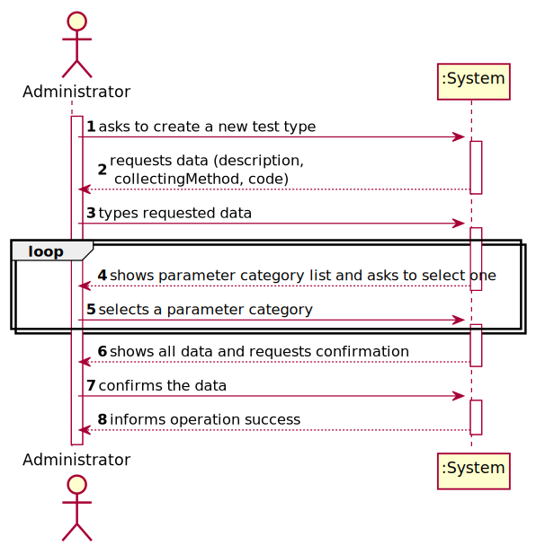
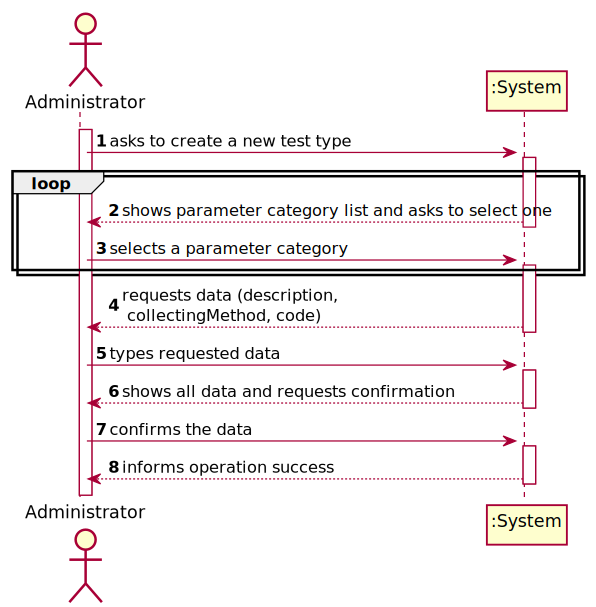
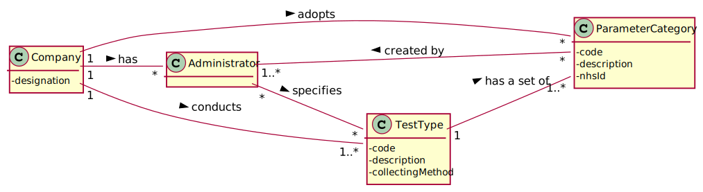
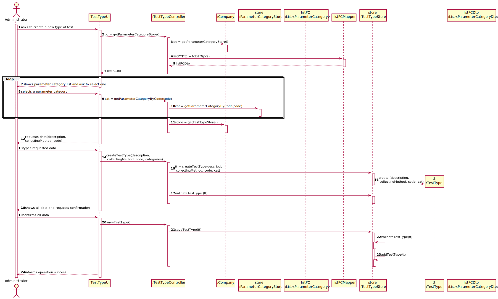
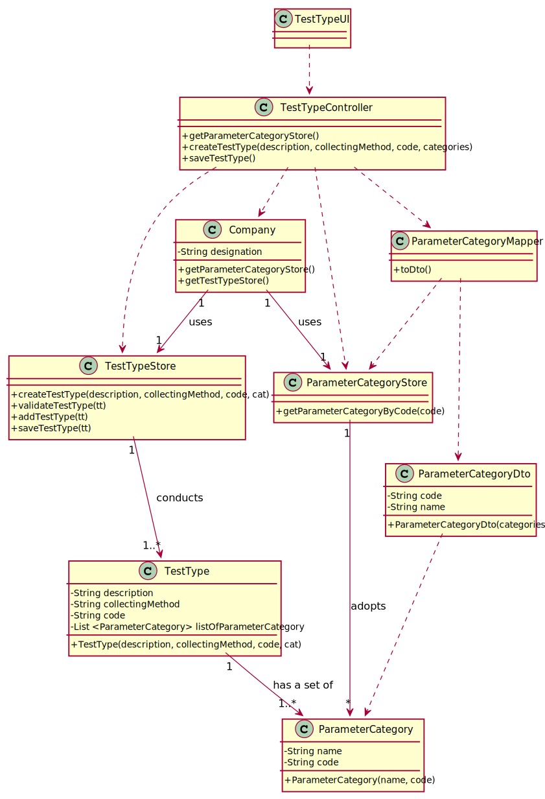

# US 009 - To create a New Type of Test and its collecting methods 

## 1. Requirements Engineering

### 1.1. User Story Description

As an administrator, I want to specify a new type of test and its collecting methods.

### 1.2. Customer Specifications and Clarifications 

**From the specifications document:**
 

**From the client clarifications:**

> **Question:** When the administrator is creating a test type does he select the parameters to be associated with it from a list or does he select the categories?
>  
> **Answer:**

-

> **Question:** What other type of input does a test type need besides its designation and sample collection method?
>  
> **Answer:** 

-

> **Question:** Does the admin select the sample collection method from a pre-existent list or does he write it?
>  
> **Answer:**

-

> **Question:** Does a type of test holds any atributte besides it's name and collecting methods?
>  
> **Answer:**

-

> **Question:** Are there any different collecting methods other than the ones currently known? Which ones?
>  
> **Answer:** Each collecting method is associated with a test type. Whenever a test type is created a collecting method should be defined.

-

> **Question:** Does a type of test holds any atributte besides it's name and collecting methods?
>  
> **Answer:** The attributes for a new test type are: Code: five alphanumeric characters; The code is not automatically generated; Description: a string with no more than 15 characters; Collecting Method: a string with no more than 20 characters; Each test type should have a set of categories. Each category should be chosen from a list of categories.

-

> **Question:** Are the collecting methods stored simpled as a word or a sentence, or does it also must contain it's description, and/or another attributes?
>  
> **Answer:** To make a Covid test you need a swab to collect a sample. To make a blood test you need sample tubes and a syringe.
When the administrator specifies a new type of test, the administrator also specifies the method to collect a sample. The administrator introduces a brief description for specifying the collecting method.

### 1.3. Acceptance Criteria

* **AC1:** The test type code must have 5 alphanumeric chars and it is not automatically generated.
* **AC2:** The test type description must be a string with no more than 15 chars.
* **AC3:** The collection method must be a string with no more than 20 chars.

### 1.4. Found out Dependencies

* There is a dependency to "US11 Create a Parameter Category" since at least one parameter category must exist to create a new test type.

### 1.5 Input and Output Data

**Input Data:**

* Typed data:
	* two descriptions (test type and collecting method)
	* a code
	
* Selected data:
	* a category

**Output Data:**

* List of existing parameter categories
* (In)Success of the operation

### 1.6. System Sequence Diagram (SSD)

**Alternative 1**

**Alternative 2**

**Other alternatives might exist.**

### 1.7 Other Relevant Remarks

* The created task stays in a "not published" state in order to distinguish from "published" tasks.

## 2. OO Analysis

### 2.1. Relevant Domain Model Excerpt 

### 2.2. Other Remarks

n/a

## 3. Design - User Story Realization 

### 3.1. Rationale

**SSD - Alternative 1 is adopted.**

| Interaction ID | Question: Which class is responsible for... | Answer  | Justification (with patterns)  |
|:-------------  |:--------------------- |:------------|:---------------------------- |
| Step 1  		 |	... interacting with the actor? | TestTypeUI   |  Pure Fabrication: there is no reason to assign this responsibility to any existing class in the Domain Model.           |
| 			  		 |	... coordinating the US? | TestTypeController | Controller                             |
| 			  		 |	... instantiating a new TestType? | TestTypeStore | High Cohesion: prevent the Company from doing many different things. |
| Step 2  		 |							 |             |                              |
| Step 3  		 |	...saving the inputted data? | TestTypeStore  | High Cohesion: prevent the Company from doing many different things.   |
| Step 4  		 |	...knowing the parameter categories to show? | ParameterCategoryStore | High Cohesion: prevent the Company from doing many different things. |
| Step 5  		 |	... saving the selected category? | ParameterCategoryStore | High Cohesion: prevent the Company from doing many different things.  |
| Step 6  		 |							 |             |                              |              
| Step 7  		 |	... validating all data (local validation)? | TestTypeStore | owns its data.| 
| 			  		 |	... validating all data (global validation)? | Company | knows all its test types.| 
| 			  		 |	... saving the created type of test? | TestTypeStore | High Cohesion: prevent the Company from doing many different things. | 
| Step 8  		 |	... informing operation success?| TestTypeUI  | IE: is responsible for user interactions.  | 

### Systematization ##

According to the taken rationale, the conceptual classes promoted to software classes are: 

 * Company
 * TestType
 * TestTypeStore
 * ParameterCategoryStore
 * ParameterCategoryMapper

Other software classes (i.e. Pure Fabrication) identified: 

 * TestTypeUI 
 * TestTypeController

## 3.2. Sequence Diagram (SD)

**Alternative 1**

**Alternative 2**

## 3.3. Class Diagram (CD)

**From alternative 1**

# 4. Tests 

**Test 1:** Check that it is not possible to create an instance of the Task class with null values. 

	@Test(expected = IllegalArgumentException.class)
		public void ensureNullIsNotAllowed() {
		Task instance = new Task(null, null, null, null, null, null, null);
	}
	

**Test 2:** Check that it is not possible to create an instance of the Task class with a reference containing less than five chars - AC2. 

	@Test(expected = IllegalArgumentException.class)
		public void ensureReferenceMeetsAC2() {
		Category cat = new Category(10, "Category 10");
		
		Task instance = new Task("Ab1", "Task Description", "Informal Data", "Technical Data", 3, 3780, cat);
	}

*It is also recommended to organize this content by subsections.* 

# 5. Construction (Implementation)

## Class CreateTaskController 

		public boolean createTask(String ref, String designation, String informalDesc, 
			String technicalDesc, Integer duration, Double cost, Integer catId)() {
		
			Category cat = this.platform.getCategoryById(catId);
			
			Organization org;
			// ... (omitted)
			
			this.task = org.createTask(ref, designation, informalDesc, technicalDesc, duration, cost, cat);
			
			return (this.task != null);
		}

## Class Organization

		public Task createTask(String ref, String designation, String informalDesc, 
			String technicalDesc, Integer duration, Double cost, Category cat)() {
		
	
			Task task = new Task(ref, designation, informalDesc, technicalDesc, duration, cost, cat);
			if (this.validateTask(task))
				return task;
			return null;
		}

# 6. Integration and Demo 

* A new option on the Employee menu options was added.

* Some demo purposes some tasks are bootstrapped while system starts.

# 7. Observations

Platform and Organization classes are getting too many responsibilities due to IE pattern and, therefore, they are becoming huge and harder to maintain. 

Is there any way to avoid this to happen?

