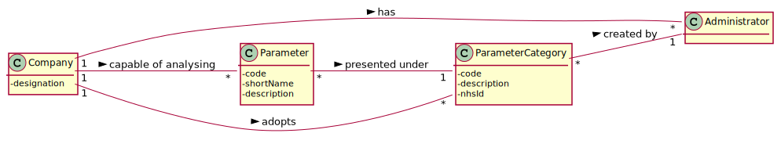
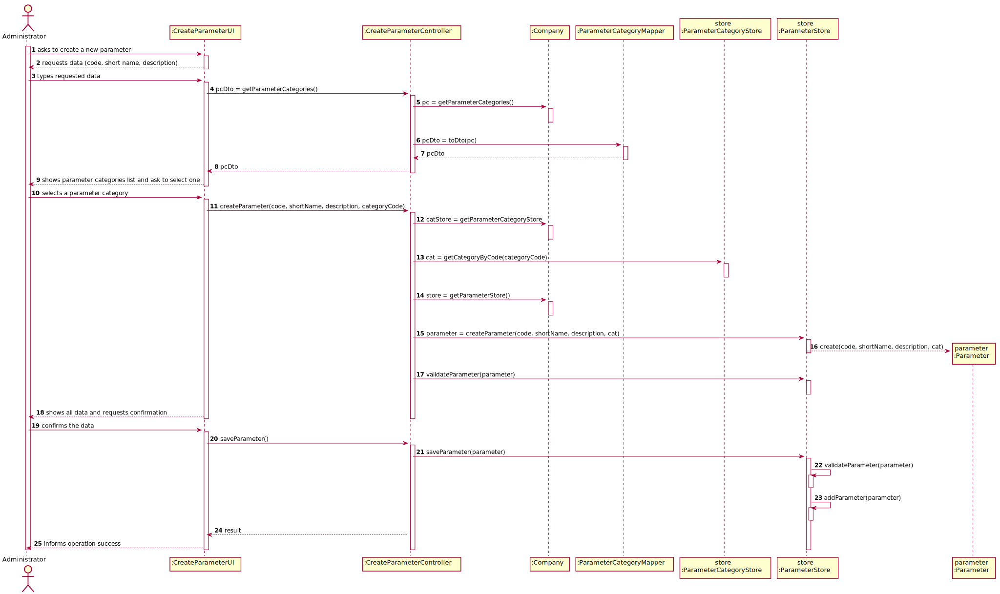
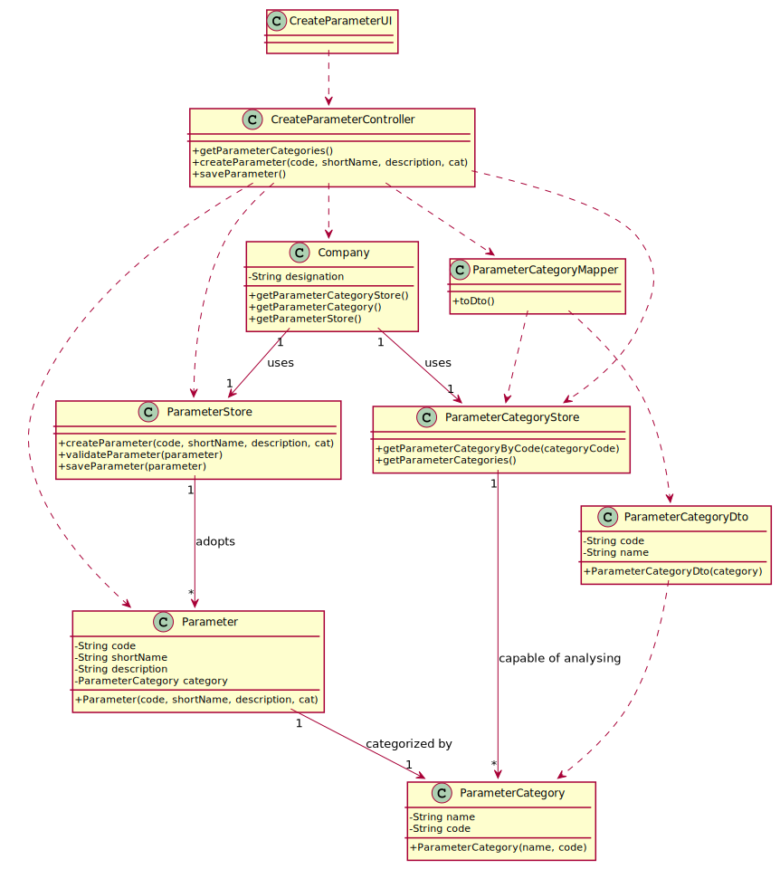

# US 010 - To create a parameter and categorize it.

## 1. Requirements Engineering

### 1.1. User Story Description

As an administrator, I want to specify a new parameter and categorize it.

### 1.2. Customer Specifications and Clarifications

###   From the specifications document:
  
   "Blood tests are frequently characterized by measuring several parameters which for presentation/reporting purposes are organized by categories."
  
###   From the client clarifications:

    
>   **Question:** "What is the data that characterize a parameter?" - [link: https://moodle.isep.ipp.pt/mod/forum/discuss.php?d=7507#p9763]

>   **Answer:** A Code, a Short Name and a Description.
            
>   **Question:** "Is the categorization of a parameter mandatory or optional?" - [link: https://moodle.isep.ipp.pt/mod/forum/discuss.php?d=7649#p9973]

>   **Answer:** Mandatory.
        
      
>   **Question:** "How does the assignment of a parameter category works?" - [link: https://moodle.isep.ipp.pt/mod/forum/discuss.php?d=7649#p9973]
      
>   **Answer:** The administrator should select one category when creating a parameter.
        
      
>   **Question:** "Does the client want to specify more than one new parameter at a time?" - [https://moodle.isep.ipp.pt/mod/forum/discuss.php?d=7616#p10189]

>   **Answer:** "Yes."
            
      
>   **Question:** "Can a parameter be classified in more than one parameter category?" - [link: https://moodle.isep.ipp.pt/mod/forum/discuss.php?d=7749#p10099]
      
>   **Answer:** No. Each parameter has only one category.
      
      

### 1.3. Acceptance Criteria

  * **AC1:** The Code are five alphanumeric characters.
  * **AC2:** The Short Name is a String with no more than 8 characters.
  * **AC3:** The Description is a String with no more than 20 characters.

### 1.4. Found out Dependencies

There is a dependency to "US11: As an administrator, I want to specify a new parameter category." since at least a parameter category must exist to classify the parameter being created.

### 1.5 Input and Output Data

**Input Data:**

* Typed data:
	* a code
    * a short name
    * a description
    
	
* Selected data:
	* Parameter Category.

**Output Data:**

* List of existing parameter categories
* (In)Success of the operation

### 1.6. System Sequence Diagram (SSD)

*Insert here a SSD depicting the envisioned Actor-System interactions and throughout which data is inputted and outputted to fulfill the requirement. All interactions must be numbered.*

### 1.7 Other Relevant Remarks

*Use this section to capture other relevant information that is related with this US such as (i) special requirements ; (ii) data and/or technology variations; (iii) how often this US is held.* 

## 2. OO Analysis

### 2.1. Relevant Domain Model Excerpt 
*In this section, it is suggested to present an excerpt of the domain model that is seen as relevant to fulfill this requirement.* 

### 2.2. Other Remarks

*Use this section to capture some aditional notes/remarks that must be taken into consideration into the design activity. In some case, it might be usefull to add other analysis artifacts (e.g. activity or state diagrams).* 

## 3. Design - User Story Realization 

### 3.1. Rationale

**The rationale grounds on the SSD interactions and the identified input/output data.**

| Interaction ID | Question: Which class is responsible for... | Answer  | Justification (with patterns)  |
|:-------------  |:--------------------- |:------------|:---------------------------- |
| Step 1         |... interacting with the actor?| CreateParameterUI | Pure Fabrication: there is no reason to assign this responsibility to any existing class in the Domain Model.|
|         		 |... coordinating the US? | CreateParameterController | Controller                             |
|        		 |... instantiating a new Parameter? | ParameterStore | High Cohesion: prevent the Company from doing many different things.  | 
| Step 2 		 |							 |             |                              |
| Step 3  		 |...saving the inputted data? | ParameterStore |  High Cohesion: prevent the Company from doing many different things.                |
| Step 4  		 |...knowing parameter category to show	| ParameterCategoryStore |  High Cohesion: prevent the Company from doing many different things. |  
| Step 5  		 |... saving the selected category?	 | ParameterCategoryStore | High Cohesion: prevent the Company from doing many different things.                             | 
| Step 6  		 |							 |             |                              | 
| Step 7  		 |... validating all data (local validation)?	| ParameterStore | IE: owns its data.             | 
|        		 |... validating all data (global validation)? | Company  | IE: knows all its parameters                             |
|       		 |... saving the created parameter?	 | ParameterStore            |                              | 
| Step 8  		 |... informing operation success?	| CreateParameterUI  | IE: is responsible for user interactions.  | 

### Systematization ##

According to the taken rationale, the conceptual classes promoted to software classes are: 

 * Company
 * ParameterCategory
 * ParameterCategoryStore
 * ParameterCategoryMapper
 * Parameter
 * ParameterStore
 

Other software classes (i.e. Pure Fabrication) identified: 

 * CreateParameterController
 * CreateParameterUI

## 3.2. Sequence Diagram (SD)

*In this section, it is suggested to present an UML dynamic view stating the sequence of domain related software objects' interactions that allows to fulfill the requirement.* 

## 3.3. Class Diagram (CD)

*In this section, it is suggested to present an UML static view representing the main domain related software classes that are involved in fulfilling the requirement as well as and their relations, attributes and methods.*

# 4. Tests 
*In this section, it is suggested to systematize how the tests were designed to allow a correct measurement of requirements fulfilling.* 

**_DO NOT COPY ALL DEVELOPED TESTS HERE_**

**Test 1:** Check that it is not possible to create an instance of the Example class with null values. 

	@Test(expected = IllegalArgumentException.class)
		public void ensureNullIsNotAllowed() {
		Exemplo instance = new Exemplo(null, null);
	}

*It is also recommended to organize this content by subsections.* 

# 5. Construction (Implementation)

*In this section, it is suggested to provide, if necessary, some evidence that the construction/implementation is in accordance with the previously carried out design. Furthermore, it is recommeded to mention/describe the existence of other relevant (e.g. configuration) files and highlight relevant commits.*

*It is also recommended to organize this content by subsections.* 

# 6. Integration and Demo 

*In this section, it is suggested to describe the efforts made to integrate this functionality with the other features of the system.*

# 7. Observations

*In this section, it is suggested to present a critical perspective on the developed work, pointing, for example, to other alternatives and or future related work.*

