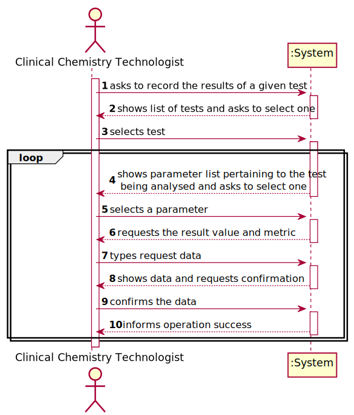
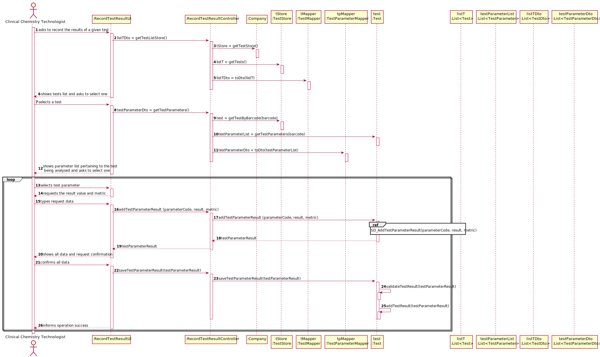
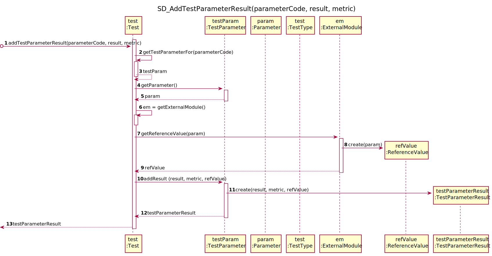

# US 012 - To record the results of a given test

## 1. Requirements Engineering

### 1.1. User Story Description

As a clinical chemistry technologist, I intend to record the results of a given test

### 1.2. Customer Specifications and Clarifications 

**From the specifications document:**

**From the client clarifications:**

> **Question:** When the Clinical Chemistry Technologist wants to record the results of a test, how does he has access to that test? By internal code, NHS code?
>  
> **Answer:** Each sample has a unique barcode. The clinical chemistry technologist should use the sample barcode number to find the test for which the sample was collected.

-

> **Question:** Should the system present a result for each test parameter or a single result for the test to be recorded?
>  
> **Answer:** The Clinical Chemistry Technologist should register a value/result for each parameter of the test.

### 1.3. Acceptance Criteria

* **AC1:** The application should use an external module that is responsible for providing the test reference values.
* **AC2:** The application can use an external module for each type of test.
* **AC3:** The API request should include, at most: (i) a key to access the module; (ii) a parameter identifier; (iii) the reference date; and (iv) reference measurement unit.

### 1.4. Found out Dependencies

* There is a dependency to "US05 Record A New Sample" since at least one sample must be registered in the system, so that the results of its parameters can be compared with the reference values.

### 1.5 Input and Output Data

**Input Data:**

* Typed data:
	* result value, 
	* metric.

	
* Selected data:
	* test,
	* test parameter.

**Output Data:**

* List of tests.
* List of test parameters.
* (In)Success of the operation.

### 1.6. System Sequence Diagram (SSD)

**Alternative 1**

**Alternative 2**

**Other alternatives might exist.**

### 1.7 Other Relevant Remarks

* The created task stays in a "not published" state in order to distinguish from "published" tasks.

## 2. OO Analysis

### 2.1. Relevant Domain Model Excerpt 

### 2.2. Other Remarks

n/a

## 3. Design - User Story Realization 

### 3.1. Rationale

**SSD - Alternative 1 is adopted.**

| Interaction ID | Question: Which class is responsible for... | Answer  | Justification (with patterns)  |
|:-------------  |:--------------------- |:------------|:---------------------------- |
| Step 1  		 |	... interacting with the actor? | RecordTestResultUI  |  Pure Fabrication: there is no reason to assign this responsibility to any existing class in the Domain Model.           |
| 			  		 |	... coordinating the US? | RecordTestResultController | Controller                             |
| Step 2  		 |		... knowing the tests to show?		 |      TestStore       |  IE and HC+LC: Owns the existing tests and prevents the Company from doing many things.                            |
|				 |	... knowing the TestStore?   |  Company  | IE: Company knows all its tests.
|                |	... process the data and convert it to dto?  |  TestMapper   | DTO: It is used so that the UI cannot contact directly with the domain model.   	|
| Step 3  		 |
| Step 4  		 |	...knowing the test parameters to show? | Test  | IE: Test contains a list of test parameters. |
|				 | 	... process the data and convert it to dto?  |  TestParameterMapper   | DTO: It is used so that the UI cannot contact directly with the domain model.   	|
| Step 5  		 |									|
| Step 6  		 |							 |             |                              |              
| Step 7  		 |  ... create a new instance of TestParameterResult?	| 	TestParameter  |	Creator (R1/R2): TestParameter agregrates objects of TestParameterResult and instances 	objects of TestParameterResult.	|
|					 |   ... adapting the interface?  | ExternalModuleAdapters	| Protected variations: Identify points of predicted variation or instability (variety of interfaces) and assign responsibilities (to the adapters) to create a stable interface around those points. |
| Step 8  		 |						| 
| Step 9 		 |   ... saving the test parameter result?	|  Test  | IE: knows all the results for the parameters of a test.  |
|			 	 | ... validating all data (global validation)?	 | Test | IE: owns the list of test parameter results. |
| Step 10 		 | ...informing operation success |	RecordTestResultUI  |  IE: is responsible for user interactions.	|

### Systematization ##

According to the taken rationale, the conceptual classes promoted to software classes are: 

 * Company
 * Test
 * TestParameter
 

Other software classes (i.e. Pure Fabrication) identified: 

 * RecordTestResultUI  
 * RecordTestResultController
 * TestMapper
 * TestStore
 * TestParameterMapper
 * ExternalModuleAdapter1
 * ExternalModuleAdapter2
 * ExternalModuleAdapter3
 
 

## 3.2. Sequence Diagram (SD)

**Alternative 1**

**Some Details**

## 3.3. Class Diagram (CD)

**From alternative 1**

# 4. Tests 

**Test 1:** Check that it is not possible to create an instance of the Task class with null values. 

	@Test(expected = IllegalArgumentException.class)
		public void ensureNullIsNotAllowed() {
		Task instance = new Task(null, null, null, null, null, null, null);
	}
	

**Test 2:** Check that it is not possible to create an instance of the Task class with a reference containing less than five chars - AC2. 

	@Test(expected = IllegalArgumentException.class)
		public void ensureReferenceMeetsAC2() {
		Category cat = new Category(10, "Category 10");
		
		Task instance = new Task("Ab1", "Task Description", "Informal Data", "Technical Data", 3, 3780, cat);
	}

*It is also recommended to organize this content by subsections.* 

# 5. Construction (Implementation)

## Class CreateTaskController 

		public boolean createTask(String ref, String designation, String informalDesc, 
			String technicalDesc, Integer duration, Double cost, Integer catId)() {
		
			Category cat = this.platform.getCategoryById(catId);
			
			Organization org;
			// ... (omitted)
			
			this.task = org.createTask(ref, designation, informalDesc, technicalDesc, duration, cost, cat);
			
			return (this.task != null);
		}

## Class Organization

		public Task createTask(String ref, String designation, String informalDesc, 
			String technicalDesc, Integer duration, Double cost, Category cat)() {
		
	
			Task task = new Task(ref, designation, informalDesc, technicalDesc, duration, cost, cat);
			if (this.validateTask(task))
				return task;
			return null;
		}

# 6. Integration and Demo 

* A new option on the Employee menu options was added.

* Some demo purposes some tasks are bootstrapped while system starts.

# 7. Observations

Platform and Organization classes are getting too many responsibilities due to IE pattern and, therefore, they are becoming huge and harder to maintain. 

Is there any way to avoid this to happen?

