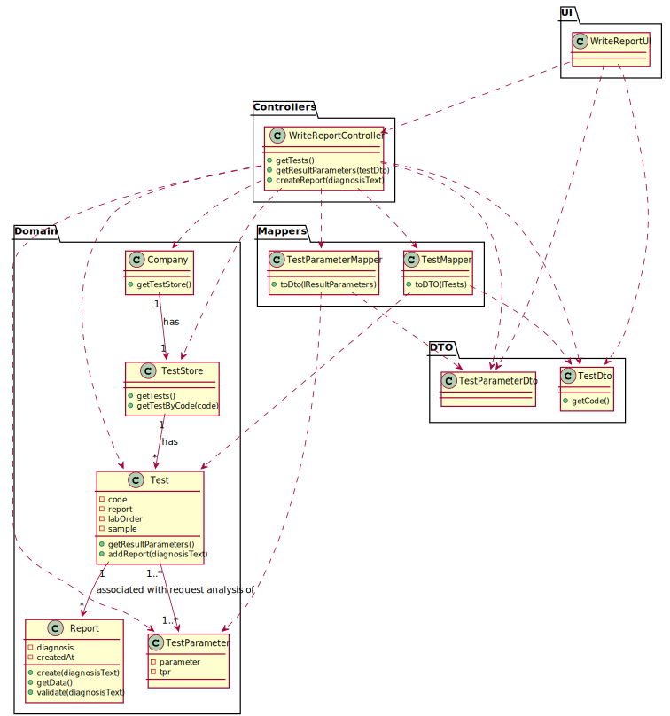

# US 014 - To make a Diagnosis and write a Report 

## 1. Requirements Engineering

### 1.1. User Story Description

As a specialist doctor, I intend to make the diagnosis and write a report for a given test.

### 1.2. Customer Specifications and Clarifications 

**From the specifications document:**

>	"The results of all chemical analyses are analysed by a specialist doctor who makes a diagnosis and writes a report that afterwards will be delivered to the client."

**From the client clarifications:**

> **Question:** "Should the specialist doctor make the diagnosis and report at the same time?" [link - https://moodle.isep.ipp.pt/mod/forum/discuss.php?d=8259#p10799]
>  
> **Answer:** 

-

> **Question:** "Should the application have a specific order for the "documents" to be made by the specialist doctor?" [link - https://moodle.isep.ipp.pt/mod/forum/discuss.php?d=8259#p10799]
>  
> **Answer:**

-

> **Question:** "How should the specialist doctor choose the test to work on?" [link - https://moodle.isep.ipp.pt/mod/forum/discuss.php?d=8259#p10799]
> 
> **Answer:**

-

> **Question:** "What characterizes a diagnosis? What it needs to have in it to be a valid diagnosis?" [link - https://moodle.isep.ipp.pt/mod/forum/discuss.php?d=8292#p10845]
>
> **Answer:** "The report contains the diagnosis. The report is free text and should have no more than 400 words."

-

> **Question:** "Regarding the tests that the Specialist Doctor can write a report about. Should the SD chose from a list of tests? and Should him only receive a list of test that have completed all the previous steps?" [link - https://moodle.isep.ipp.pt/mod/forum/discuss.php?d=8250#p10889]
> 
> **Answer:** "The system shows all tests ready (that have completed all the previous steps) to make the diagnosys and the Specialist Doctor selects one test. Then, the Specialist Doctor writes the report for the selected test."

-

> **Question:** "Can the Specialist Doctor edit a report once it has already been written?" [link - https://moodle.isep.ipp.pt/mod/forum/discuss.php?d=8268#p10898]
>
> **Answer:** "No."

-

> **Question:** "Once the specialist doctor decides to write the report for a given test, should the results of the chemical analysis and the reference values be presented on the screen?" [link - https://moodle.isep.ipp.pt/mod/forum/discuss.php?d=8497#p11183]

> **Answer:** "After selecting a test (to make the diagnosis/report) the results of the chemical analysis and the reference values should be presented on the screen. Then the Specialist Doctor should write the report."

-

> **Question:** "While in the 'Make a diagnosis and write a report' option of the main menu, should the specialist doctor be able to make a diagnosis and write a report for more than one test?" [link - https://moodle.isep.ipp.pt/mod/forum/discuss.php?d=8497#p11183]

> **Answer:** "After writing a report the SD can choose to write other reports without leaving the use case."

### 1.3. Acceptance Criteria

* **AC1:** The report is free text and should have no more than 400 words.

### 1.4. Found out Dependencies

* There is a dependency to "US012 Record the results of a test" since at least a result of a test must recorded to create the corresponding report and diagnosis.

### 1.5 Input and Output Data

**Input Data:**

* Typed data:
	* a Report.
	
* Selected data:
	* Test to be perfomed a report and diagnosis.

**Output Data:**

* List of tests;
* (In)success of the operation.

### 1.6. System Sequence Diagram (SSD)

**Alternative 1**

### 1.7 Other Relevant Remarks

## 2. OO Analysis

### 2.1. Relevant Domain Model Excerpt 

### 2.2. Other Remarks

n/a

## 3. Design - User Story Realization 

### 3.1. Rationale

**SSD - Alternative 1 is adopted.**

| Interaction ID | Question: Which class is responsible for... | Answer  | Justification (with patterns)  |
|:-------------  |:--------------------- |:------------|:---------------------------- |
| Step 1  		 |	... interacting with the actor? | CreateTaskUI   |  Pure Fabrication: there is no reason to assign this responsibility to any existing class in the Domain Model.           |
| 			  		 |	... coordinating the US? | CreateTaskController | Controller                             |
| 			  		 |	... instantiating a new Task? | Organization   | Creator (Rule 1): in the DM Organization has a Task.   |
| 			  		 | ... knowing the user using the system?  | UserSession  | IE: cf. A&A component documentation.  |
| 			  		 |	... knowing to which organization the user belongs to? | Platform  | IE: has registed all Organizations |
| 			  		 |							 | Organization   | IE: knows/has its own Employees|
| 			  		 |							 | Employee  | IE: knows its own data (e.g. email) |
| Step 2  		 |							 |             |                              |
| Step 3  		 |	...saving the inputted data? | Task  | IE: object created in step 1 has its own data.  |
| Step 4  		 |	...knowing the task categories to show? | Platform  | IE: Task Categories are defined by the Platform. |
| Step 5  		 |	... saving the selected category? | Task  | IE: object created in step 1 is classified in one Category.  |
| Step 6  		 |							 |             |                              |              
| Step 7  		 |	... validating all data (local validation)? | Task | IE: owns its data.| 
| 			  		 |	... validating all data (global validation)? | Organization | IE: knows all its tasks.| 
| 			  		 |	... saving the created task? | Organization | IE: owns all its tasks.| 
| Step 8  		 |	... informing operation success?| CreateTaskUI  | IE: is responsible for user interactions.  | 

### Systematization ##

According to the taken rationale, the conceptual classes promoted to software classes are: 

 * Organization
 * Platform
 * Task

Other software classes (i.e. Pure Fabrication) identified: 

 * CreateTaskUI  
 * CreateTaskController

## 3.2. Sequence Diagram (SD)

**Alternative 1**

## 3.3. Class Diagram (CD)

# 4. Tests 

**Test 1:** Check that it is not possible to create an instance of the Task class with null values. 

	@Test(expected = IllegalArgumentException.class)
		public void ensureNullIsNotAllowed() {
		Task instance = new Task(null, null, null, null, null, null, null);
	}
	

**Test 2:** Check that it is not possible to create an instance of the Task class with a reference containing less than five chars - AC2. 

	@Test(expected = IllegalArgumentException.class)
		public void ensureReferenceMeetsAC2() {
		Category cat = new Category(10, "Category 10");
		
		Task instance = new Task("Ab1", "Task Description", "Informal Data", "Technical Data", 3, 3780, cat);
	}

*It is also recommended to organize this content by subsections.* 

# 5. Construction (Implementation)

## Class CreateTaskController 

		public boolean createTask(String ref, String designation, String informalDesc, 
			String technicalDesc, Integer duration, Double cost, Integer catId)() {
		
			Category cat = this.platform.getCategoryById(catId);
			
			Organization org;
			// ... (omitted)
			
			this.task = org.createTask(ref, designation, informalDesc, technicalDesc, duration, cost, cat);
			
			return (this.task != null);
		}

## Class Organization

		public Task createTask(String ref, String designation, String informalDesc, 
			String technicalDesc, Integer duration, Double cost, Category cat)() {
		
	
			Task task = new Task(ref, designation, informalDesc, technicalDesc, duration, cost, cat);
			if (this.validateTask(task))
				return task;
			return null;
		}

# 6. Integration and Demo 

* A new option on the Employee menu options was added.

* Some demo purposes some tasks are bootstrapped while system starts.

# 7. Observations

Platform and Organization classes are getting too many responsibilities due to IE pattern and, therefore, they are becoming huge and harder to maintain. 

Is there any way to avoid this to happen?

