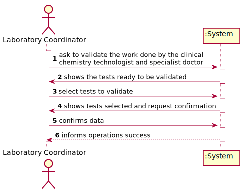
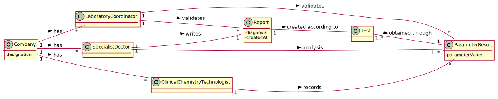
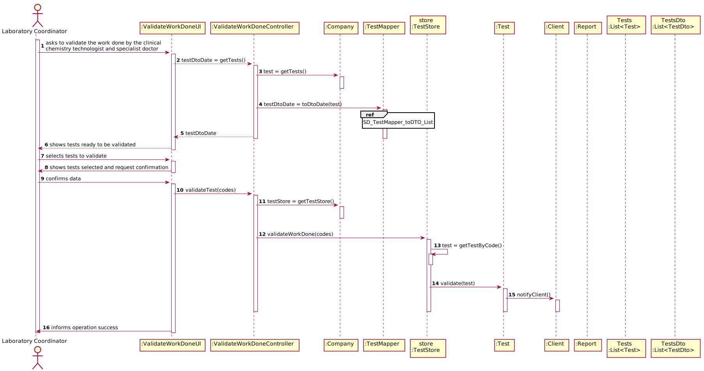
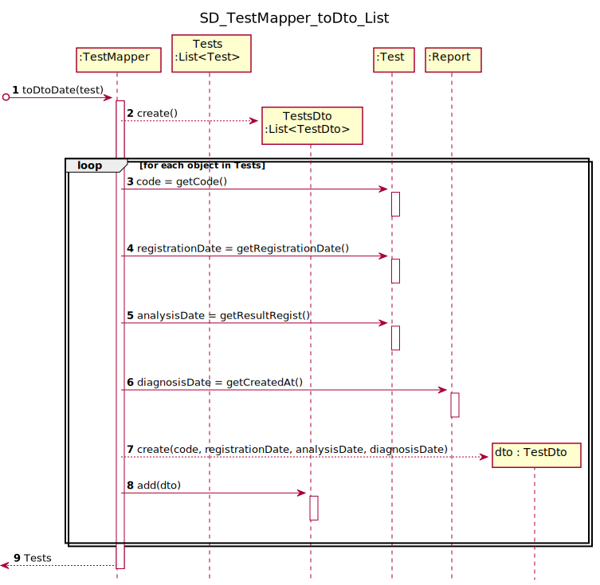
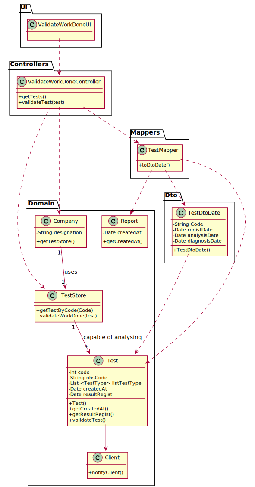

# US 015 - To validate the work done by the clinical chemistry technologist and specialist doctor

## 1. Requirements Engineering

### 1.1. User Story Description

  As a laboratory coordinator, I want to validate the work done by the clinical chemistry technologist and specialist doctor. 

### 1.2. Customer Specifications and Clarifications 

**From the specifications document:**

>	"After the specialist doctor has completed the diagnosis, the results of the clinical analyses and the report become available in the system and must be validated by the laboratory coordinator. To validate the work done, the laboratory coordinator checks the chemical test/result and associated diagnosis made and confirms that everything was done correctly."

**From the client clarifications:**

> **Question:** "Regarding the process of validating a certain test/result, what validation states should be considered by the laboratory coordinator? For example, can "Valid" or "Invalid" be accepted as a confirmation for the chemical test/result and its diagnosis?" - [link: https://moodle.isep.ipp.pt/mod/forum/discuss.php?d=8251#p10789]
>  
> **Answer:** Only valid state. The system shows all tests ready to validate and the laboratory coordinator selects one or more tests to mark as validated. 

-

> **Question:** "Should the laboratory coordinator validate the test results one by one or should he do only one validation of all of them?" - [link: https://moodle.isep.ipp.pt/mod/forum/discuss.php?d=8180#p10708]
>  
> **Answer:** The coordinator can validate all or a subset of test results.

-

> **Question:** "When the laboratory coordinator wants to validate a test does all the tests available show up for him or does he search using a code that identifies a specific test?" - [link: https://moodle.isep.ipp.pt/mod/forum/discuss.php?d=8177#p10704]
>  
> **Answer:** The system shows all tests ready to validate and the laboratory coordinator selects one or more tests to mark as validated.

-

> **Question:** "What should happen to a test if either the test report or the results are invalid?" - [link: https://moodle.isep.ipp.pt/mod/forum/discuss.php?d=8177#p10704]
>  
> **Answer:** The laboratory coordinator only sees the test dates of tests that already have all dates registered in the system.

-

> **Question:** "What's the Criteria to the validation of the test? We only receive dates but what do we have to do to check if everything is "ok" to validate?" - [link: https://moodle.isep.ipp.pt/mod/forum/discuss.php?d=8538#p11190]
>  
> **Answer:** The lab coordinator only checks the dates (date and time) and validates a subset of tests that he selects. The lab coordinador does not check any other information.

-

> **Question:** "After we validate, we send the email saying they can check the app for the results. But what happens to the test ifself? Does it stay within the system or is deleted?" - [link: https://moodle.isep.ipp.pt/mod/forum/discuss.php?d=8538#p11190]
>  
> **Answer:** The tests should not be eliminated.

-

> **Question:** "After validation do we need to have the time and date of the validation?" - [link: https://moodle.isep.ipp.pt/mod/forum/discuss.php?d=8408#p10997]
>  
> **Answer:** Yes, the system should record the date and time when the validation was made.

### 1.3. Acceptance Criteria

* **AC1:** The system does not show client personal information but shows all dates (test registration date, chemical analysis date and diagnosis date).4

### 1.4. Found out Dependencies

* There is a dependency to "US04 Regist a test" since the test has to be registered in the system.
* There is a dependency to "US012 Record the results of a given test" since the clinical chemistry technologist must have recorded the test results.
* There is a dependency to "US014 Make the diagnosis and write a report" since the specialist doctor must have made the diagnosis and written the report.

### 1.5 Input and Output Data

**Input Data:**

* Typed data:

	
* Selected data:
	* Test or tests to be validated

**Output Data:**

* List of tests ready to validate
* (In)Success of the operation

### 1.6. System Sequence Diagram (SSD)

**Alternative 1**

**Other alternatives might exist.**

### 1.7 Other Relevant Remarks

## 2. OO Analysis

### 2.1. Relevant Domain Model Excerpt 

### 2.2. Other Remarks

## 3. Design - User Story Realization 

### 3.1. Rationale

**SSD - Alternative 1 is adopted.**

| Interaction ID | Question: Which class is responsible for... | Answer  | Justification (with patterns)  |
|:-------------  |:--------------------- |:------------|:---------------------------- |
| Step 1  		 |	... interacting with the actor? | ValidateWorkDoneUI   |  Pure Fabrication: there is no reason to assign this responsibility to any existing class in the Domain Model.           |
| 			  		 |	... coordinating the US? | ValidateWorkDoneController | Controller                             |
| Step 2  		 |	... knowing tests to show?	 | TestStore             |  IE: TestStore has the responsability to know all the tests.         |
|            	 |	...knowing the testStore? | Company  | IE: Company has the responsability to know the TestStore.  |
|       		 |	... transfer the domain objects in DTO? | TestDtoDate  | DTO: The ValidateWorkDoneUI can't have access to the tests |
| Step 3  		 |							 |             |                              |              
| Step 4  		 |	... showing the information to be confirmed | ValidateWorkDoneUI | IE: knows what the user selected.| 
| Step 5 		 |	... set validation date?| Test | IE: owns its data.| 
|       		 |	... notify client?      | Client   | IE: owns personal information of the client.                       |   
| Step 6 		 |	... informing operation success?| ValidateWorkDoneUI  | IE: is responsible for user interactions.  | 

### Systematization ##

According to the taken rationale, the conceptual classes promoted to software classes are: 

 * Report
 * Company
 * Test
 * Client

Other software classes (i.e. Pure Fabrication) identified: 

 * ValidateWorkDoneUI  
 * ValidateWorkDoneController
 * TestMapper
 * TestDtoDate
 * TestStore

## 3.2. Sequence Diagram (SD)

## 3.3. Class Diagram (CD)

**From alternative 1**

# 4. Tests 

**Test 1:** Check if the TestDtoDate have the same dates that Test. 

	@Test
    public void testToString() {
        Date registrationDate = new Date();
        Date analysisDate = new Date();
        Date diagnosisDate = new Date();

        TestDtoDate test = new TestDtoDate("000000000001",registrationDate, analysisDate, diagnosisDate);
        String expect = String.format("Code: 000000000001 %nRegistration Date: %s %nAnalysisDate: %s %nDiagnosis Date: %s", registrationDate, analysisDate, diagnosisDate);
        String actual = test.toString();

        Assert.assertEquals(expect, actual);
    }
	

**Test 2:** Check if the validation date are recorded with success. 

	@Test
    public void testValidateTest() throws ClassNotFoundException, InstantiationException, IllegalAccessException, IOException {
        Company c = new Company("Many Labs");

        Client client = new Client(1234567890123456L,1234567890,"12/12/2012","Male",1234567890,"asd@gmail.com","Moirane",44123456789L);

        ParameterCategory pc = new ParameterCategory("hemogram", "09090");
        ParameterCategory pc1 = new ParameterCategory("Immunity", "11111");

        List<ParameterCategory> listPC = new ArrayList<>();

        App.getInstance().getCompany().getParameterCategoryStore().addToList(pc);
        App.getInstance().getCompany().getParameterCategoryStore().addToList(pc1);

        ParameterCategory pCat = App.getInstance().getCompany().getParameterCategoryStore().getParameterCategoryByCode("11111");

        listPC.add(pCat);

        TestType tt = new TestType("Covid-19", "swab", "12345", listPC);

        Parameter p = new Parameter("998la", "a-bodies", "antibodies",pCat);

        App.getInstance().getCompany().getParameterStore().addParameter(p);
        List <Parameter> listOfPar = App.getInstance().getCompany().getParameterStore().getParameterList();
        LabOrder lO = new LabOrder(tt,listOfPar);

        app.domain.model.Test test = new app.domain.model.Test(c,client, 123456789123L, lO);

        test.validateTest();
        Date expect = test.getValidationDate();

        Date actual = test.getValidationDate();

        Assert.assertEquals(expect,actual);
    }

*It is also recommended to organize this content by subsections.* 

# 5. Construction (Implementation)

## Class ValidateWorkDoneController 

		public void validateTests(List<String> codes) throws IOException {
        for (String code: codes){
            company.getTestStore().validateWorkDone(code);
        }
    }

## Class Test

		 public void validateTest() throws IOException {

           validationDate = new Date();
           client.notifyClient();
        }

# 6. Integration and Demo 

* A new option on the Employee menu options was added.

* Some demo purposes some tasks are bootstrapped while system starts.

# 7. Observations

Platform and Organization classes are getting too many responsibilities due to IE pattern and, therefore, they are becoming huge and harder to maintain. 

Is there any way to avoid this to happen?

