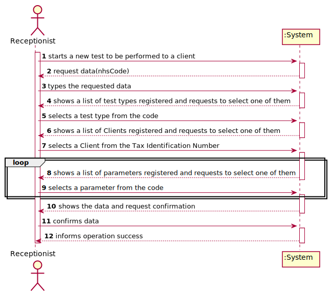
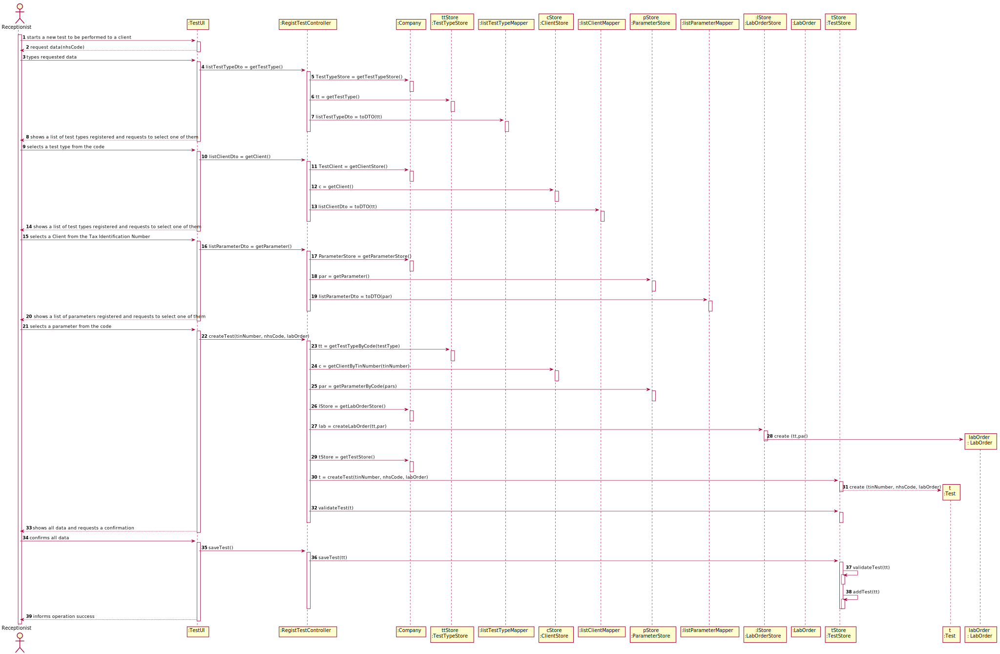
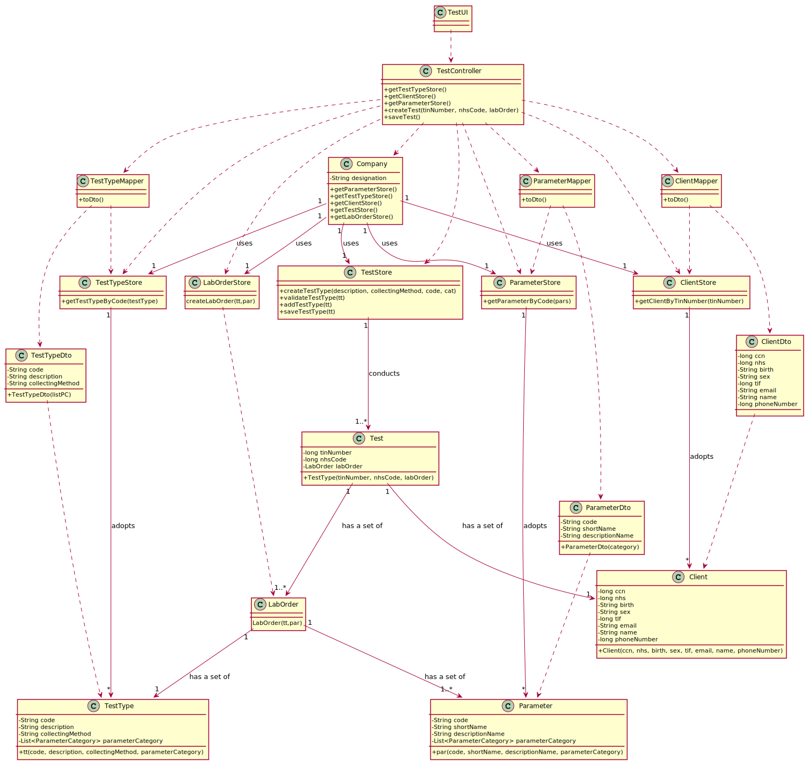

# US 004 - To register a new Test

## 1. Requirements Engineering

### 1.1. User Story Description

As an receptionist of the laboratory, I want to register a test to be performed to a registered client.

### 1.2. Customer Specifications and Clarifications 

**From the specifications document:**

>	Each task is characterized by having a unique reference per organization, a designation, an informal and a technical description, an estimated duration and cost as well as the its classifying task category. 

>	As long as it is not published, access to the task is exclusive to the employees of the respective organization. 

**From the client clarifications:**

> **Question:** How is it possible to know in which laboratory the test is being registered? Should the Receptionist select the Laboratory before selecting the Test Type?
>  
> **Answer:** After login the receptionist should select the laboratory where she is working. Then, the receptionist has access to the system's features/functionalities.

-

> **Question:** Shouldn't the receptionist locate the Client by the Citizen Card Number instead of TIN Number?
>  
> **Answer:** The receptionist should use the TIN number to find the client.

-

> **Question:** You've said on previous questions that the NHS code contains 12 characters and is alphanumeric, so this will be different from the NHS number from the client, am I right? If so, how do we know a certain test is associated to a client?
>  
> **Answer:** A test has a NHS code and a client has a NHS number. In US4 the receptionist of the laboratory should ask the client to get his TIN number. Using the TIN number the receptionist of the laboratory can find all information about the client. Do not forget that a client should be registered in the system to make a test.

-

> **Question:** On the project description it says "Each test is characterized by an internal code, an NHS code, a description that identifies the sample collection method...". You said that the code is a 12 digit sequential number. Does this mean that, for example, the first test will have the code "000000000001" and so on?
>  
> **Answer:** Yes.

-

> **Question:** And should the description that identifies the sample collection method be automatically filled with the collection method associated with the type of test?
>  
> **Answer:** Yes. In a previous post I said that "There exists only one collection method per test type".

### 1.3. Acceptance Criteria

* **AC1:** The TIN number registered must be connected to a client.
* **AC2:** The NHS code of the test must have 12 characters.
* **AC3:** A Laboratory Order can have unlimited parameters, but only have one test type.
* **AC4:** The Test Type should be added to the Laboratory Order inserting the Test Type code.
* **AC5:** The Parameter(s) should be added to the Laboratory Order inserting the Parameter(s) code(s).

### 1.4. Found out Dependencies

No dependencies.

### 1.5 Input and Output Data

**Input Data:**

* Typed data:
	* a National Health Security Number, 
	
* Selected data:
	* a Lab Order (which contains a type of test and a parameter)
	* a Tax Identification Number (which must be connected to a Client)

**Output Data:**
* List of existing Types of Tests
* List of existing Clients
* List of existing Parameters
* (In)Success of the operation

### 1.6. System Sequence Diagram (SSD)

**Other alternatives might exist.**

### 1.7 Other Relevant Remarks

* N/A.

## 2. OO Analysis

### 2.1. Relevant Domain Model Excerpt 

### 2.2. Other Remarks

n/a

## 3. Design - User Story Realization 

### 3.1. Rationale

| Interaction ID | Question: Which class is responsible for... | Answer  | Justification (with patterns)  |
|:-------------  |:--------------------- |:------------|:---------------------------- |
| Step 1  		 |	... interacting with the actor? | TestUI   |  Pure Fabrication: there is no reason to assign this responsibility to any existing class in the Domain Model.           |
| 			     |	... coordinating the US? | RegistTestController | Controller                             |
| Step 2  		 |							                                                                                 |
| Step 3  		 |                                                                                                          |
| Step 4  		 |	...knowing the Test Type to show?  |  TestTypeStore |  IE + HC + LC: Owns all the Test Types. Prevents the Company of doing to many things.  |
|                |  ...process the data and convert it to DTO?  |  TestTypeMapper  |  DTO: The UI can't interact directly with the domain  |
| Step 5  		 |	
| Step 6  	     |  ...knowing the Clients to show?  |  ClientStore |  IE + HC + LC: Owns all the Clients. Prevents the Company of doing to many things. |        
|                |  ...process the data and convert it to DTO?  |  ClientMapper  |  DTO: The UI can't interact directly with the domain  |
| Step 7  		 |	
| Step 8  		 |  ...knowing the Parameters to show?  |  ParameterStore |  IE + HC + LC: Owns all the Parameters. Prevents the Company of doing to many things. 
|                |  ...process the data and convert it to DTO?  |  ParameterMapper  |  DTO: The UI can't interact directly with the domain  |
| Step 9  		 |  ...instanciate a new LabOrder?  |  LabOrderStore  |  Creator(R1/R2) and HC+LC: Applying the Creator (R1/R2) would be in the "Company". But, by applying HC + LC to the "Company", this transfers the responsibility to the LabOrderStore class    |
|                |  ...instanciate a new Test?  |  TestStore  |   Creator(R1/R2) and HC+LC: Applying the Creator (R1/R2) would be in the "Company". But, by applying HC + LC to the "Company", this transfers the responsibility to the TestStoreStore class    |
|                |  ... validating all data (local validation)?  |  Test  |  	IE: owns its data.   | 
|                |  ... validating all data (global validation)?  |  TestStore  |       IE: owns its data.    |
| Step 10  		 | 
| Step 11  		 |  ... validating all data (global validation)?  |  TestStore  |       IE: owns its data.    |
|                |  ... saving the test?  |   TestStore   |   TestStore saves the test.    |
| Step 12 		 |  ... informing operation success?   |  TestUI  |  IE: is responsible for user interactions.   |

### Systematization ##

According to the taken rationale, the conceptual classes promoted to software classes are: 

 * Company
 * TestTypeMapper
 * TestTypeStore
 * ParameterStore
 * ParameterMapper
 * ClientStore
 * ClientMapper
 * TestStore
 * Test

Other software classes (i.e. Pure Fabrication) identified: 

 * TestUI 
 * TestController

## 3.2. Sequence Diagram (SD)

## 3.3. Class Diagram (CD)

**From alternative 1**

# 4. Tests 

**Test 1:** Check that it is not possible to create an instance of the Task class with null values. 

	@Test(expected = IllegalArgumentException.class)
		public void ensureNullIsNotAllowed() {
		Task instance = new Task(null, null, null, null, null, null, null);
	}
	

**Test 2:** Check that it is not possible to create an instance of the Task class with a reference containing less than five chars - AC2. 

	@Test(expected = IllegalArgumentException.class)
		public void ensureReferenceMeetsAC2() {
		Category cat = new Category(10, "Category 10");
		
		Task instance = new Task("Ab1", "Task Description", "Informal Data", "Technical Data", 3, 3780, cat);
	}

*It is also recommended to organize this content by subsections.* 

# 5. Construction (Implementation)

## Class CreateTaskController 

		public boolean createTask(String ref, String designation, String informalDesc, 
			String technicalDesc, Integer duration, Double cost, Integer catId)() {
		
			Category cat = this.platform.getCategoryById(catId);
			
			Organization org;
			// ... (omitted)
			
			this.task = org.createTask(ref, designation, informalDesc, technicalDesc, duration, cost, cat);
			
			return (this.task != null);
		}

## Class Organization

		public Task createTask(String ref, String designation, String informalDesc, 
			String technicalDesc, Integer duration, Double cost, Category cat)() {
		
	
			Task task = new Task(ref, designation, informalDesc, technicalDesc, duration, cost, cat);
			if (this.validateTask(task))
				return task;
			return null;
		}

# 6. Integration and Demo 

* A new option on the Employee menu options was added.

* Some demo purposes some tasks are bootstrapped while system starts.

# 7. Observations

Platform and Organization classes are getting too many responsibilities due to IE pattern and, therefore, they are becoming huge and harder to maintain. 

Is there any way to avoid this to happen?

