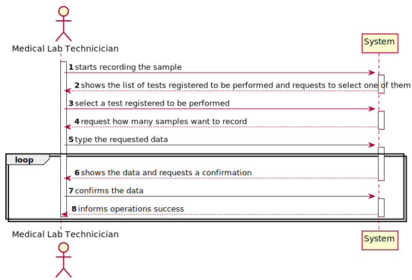
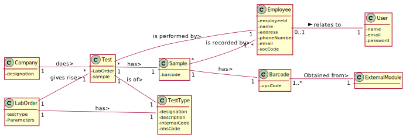
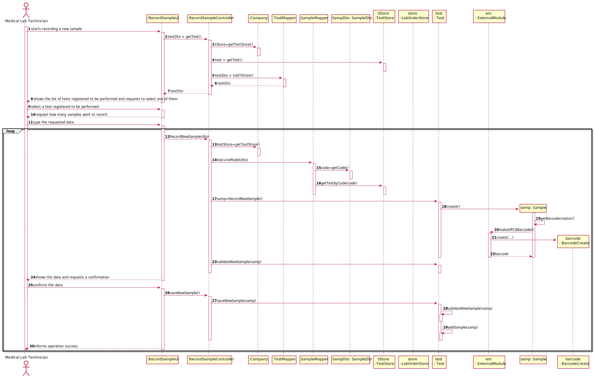
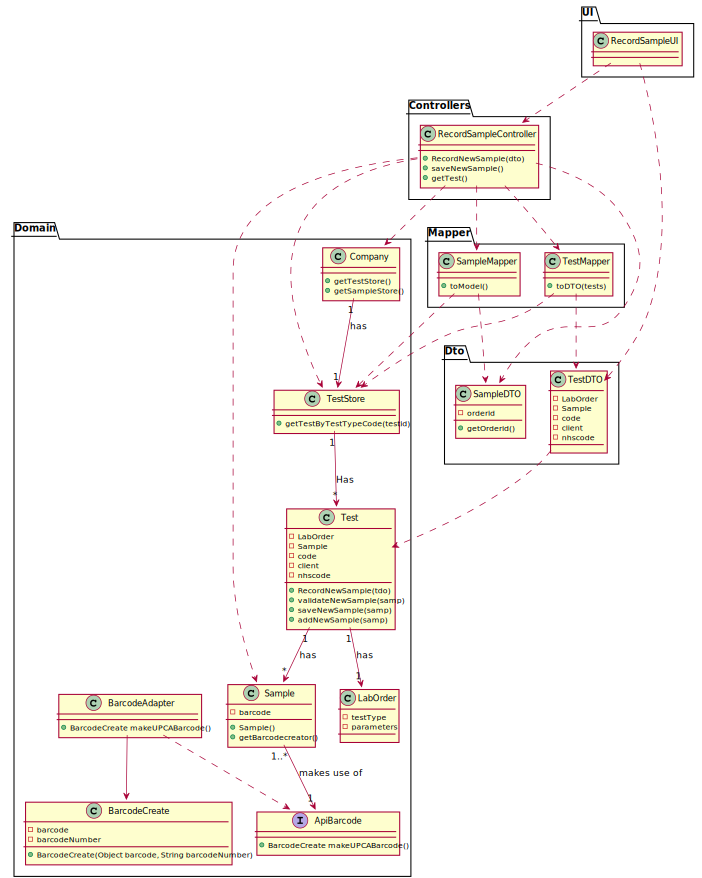

# US 003 - To register a client  

## 1. Requirements Engineering

### 1.1. User Story Description

As a medical lab technician, I want to record the samples collected in the scope of a given test

### 1.2. Customer Specifications and Clarifications 

**From the specifications document:**

> "In case of a new client, the receptionist registers the client in the application. To register a client, the receptionist needs the client�s citizen card number, National Healthcare Service (NHS) number, birth date, sex, Tax Identification number (TIF), phone number, e-mail and name."

**From the client clarifications:**

> **Question:** "After being registered by the receptionist, should the client receive some kind of confirmation e-mail in order to finish his registration?"
>  
> **Answer:** "The client only receives an e-mail informing that the registration was successful and that he can start to use the system. The e-mail includes the client password." - [link: https://moodle.isep.ipp.pt/mod/forum/discuss.php?d=7736#p10133]

### 1.3. Acceptance Criteria

* **AC1:** The system should support several barcode APIs. The API to use is defined by configuration

### 1.4. Found out Dependencies

* There is a dependency to "US004 Create a test to be registered" since at least a test must exist to record the sample.

### 1.5 Input and Output Data

**Input Data:**
	
* Selected data: Test.

**Output Data:**

* (In)Success of the operation

### 1.6. System Sequence Diagram (SSD)

**Alternative 1**

### 1.7 Other Relevant Remarks

* The created task stays in a "not published" state in order to distinguish from "published" tasks.

## 2. OO Analysis

### 2.1. Relevant Domain Model Excerpt 

### 2.2. Other Remarks

n/a

## 3. Design - User Story Realization 

### 3.1. Rationale

**SSD - Alternative 1 is adopted.**

| Interaction ID | Question: Which class is responsible for...                     | Answer                        | Justification (with patterns)                                                                                                                                                                          |
|:-------------  |:--------------------------------------------------------------- |:-----------------------------:|:------------------------------------------------------------------------------------------------------------------------------------------------------------------------------------------------------ |
| Step 1  		 | ... interacting with the actor?                                 | RecordSampleUI                | **Pure Fabrication**: none of the domain models classes had the responsability of interactiong with the user.                                                                                          |
|                | ... coordinating the US?                                        | RecordSampleController        | **Controller**                                                                                                                                                                                         |
| Step 2  		 | ... knowing the tests to show?                                  | TestStore                     | **Information Expert**: Owns the existing tests.                                                                                                                                                       |
|                | ... process the data and convert it to dto                      | TestDTO                       | **DTO**: So that the UI can't interact directly with the domain.                                                                                                                                       |
| Step 3  		 | ... saving the selected test?                                   | Sample                        | **Information Expert**: knowing to which test is associated                                                                                                                                            |
| Step 4  		 |                                                                 |                               |                                                                                                                                                                                                        |
| Step 5  		 | ... knowing the number of samples?                              | Test                          |**Information Expert**: knowing how many samples were collected.                                                                                                                                        |
| 		         | ... instantiating a new Sample?                                 | Test                          | **Creator (R1)** and **HC+LC**: Applying the Creator (R1) would be in the "Company". But, by applying HC + LC to the "Company", this transfers the responsibility to the test class                    |
|        		 | ... validating all data (local validation)?                     | Sample                        | IE: owns its data.                                                                                                                                                                                     |
|        		 | ... validating all data (global validation)?                    | Test                          | IE: owns its data.                                                                                                                                                                                     |
| Step 6  		 |                                                                 |                               |                                                                                                                                                                                                        |
| Step 7  		 | ... validating all data (global validation)?                    | Test                          | IE: owns its data.                                                                                                                                                                                     |
| Step 8  		 | ... informing operation success?                                | RecordSampleUI                | IE: is responsible for user interactions.                                                                                                                                                              |

### Systematization ##

According to the taken rationale, the conceptual classes promoted to software classes are: 

 * Sample
 * Test
 * TestStore
 * TestDto

Other software classes (i.e. Pure Fabrication) identified: 

 * RecordSampleUI  
 * RecordSampleController

## 3.2. Sequence Diagram (SD)

**Alternative 1**

## 3.3. Class Diagram (CD)

**From alternative 1**

# 4. Tests 

**Test 1:** Check that it is not possible to create an instance of the Task class with null values. 

	@Test(expected = IllegalArgumentException.class)
		public void ensureNullIsNotAllowed() {
		Task instance = new Task(null, null, null, null, null, null, null);
	}
	

**Test 2:** Check that it is not possible to create an instance of the Task class with a reference containing less than five chars - AC2. 

	@Test(expected = IllegalArgumentException.class)
		public void ensureReferenceMeetsAC2() {
		Category cat = new Category(10, "Category 10");
		
		Task instance = new Task("Ab1", "Task Description", "Informal Data", "Technical Data", 3, 3780, cat);
	}

*It is also recommended to organize this content by subsections.* 

# 5. Construction (Implementation)

## Class CreateTaskController 

		public boolean createTask(String ref, String designation, String informalDesc, 
			String technicalDesc, Integer duration, Double cost, Integer catId)() {
		
			Category cat = this.platform.getCategoryById(catId);
			
			Organization org;
			// ... (omitted)
			
			this.task = org.createTask(ref, designation, informalDesc, technicalDesc, duration, cost, cat);
			
			return (this.task != null);
		}

## Class Organization

		public Task createTask(String ref, String designation, String informalDesc, 
			String technicalDesc, Integer duration, Double cost, Category cat)() {
		
	
			Task task = new Task(ref, designation, informalDesc, technicalDesc, duration, cost, cat);
			if (this.validateTask(task))
				return task;
			return null;
		}

# 6. Integration and Demo 

* A new option on the Employee menu options was added.

* Some demo purposes some tasks are bootstrapped while system starts.

# 7. Observations

Platform and Organization classes are getting too many responsibilities due to IE pattern and, therefore, they are becoming huge and harder to maintain. 

Is there any way to avoid this to happen?

