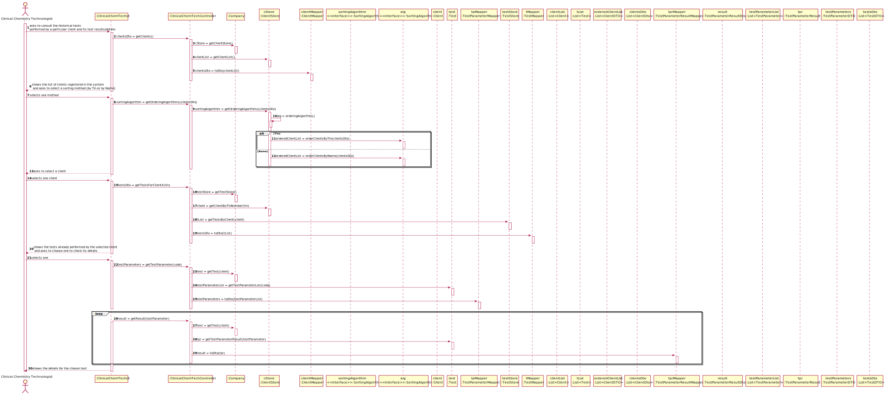

# US 013 - To consult the tests performed by a particular client

## 1. Requirements Engineering

### 1.1. User Story Description

As a clinical chemistry technologist, I intend to consult the historical tests performed by a particular client and to be able to check tests details/results.

### 1.2. Customer Specifications and Clarifications 

**From the specifications document:**

> "(...) The results are also available in the central application where (...) the clinical chemistry technologist (...) can check them."

**From the client clarifications:**

> **Question:** "In US13 acceptance criteria, "The application must allow ordering the clients by TIN and by name...". What do you mean by that? Is there a priority in ordering between name and TIN?" [link - https://moodle.isep.ipp.pt/mod/forum/discuss.php?d=9246#p12176]
>  
> **Answer:** "The user can chose to sort the clients by name OR by TIN."

> **Question:** "In the User Story 13, the Clinical Chemistry Technologist to "choose the target client" needs to type the name (or TIN number)? Or should be a list present with all the client's available and, after that, be possible to select one?" [link - https://moodle.isep.ipp.pt/mod/forum/discuss.php?d=9181#p12113]
>  
> **Answer:** "From the requirements introduced in the beginning of Sprint D: "The application must allow ordering the clients by TIN and by name to help the clinical chemistry technologist choose the target client". A sorted list should be presented to the clinical chemistry technologist."

> **Question:** "In US13, the Clinical Chemistry Technologist, can select more than one client at once to view its historical test results?" [link - https://moodle.isep.ipp.pt/mod/forum/discuss.php?d=9178#p12112]
>  
> **Answer:** "No."

> **Question:** "Moreover, will all the tests associated with the client be displayed or the clinical chemistry technologist will have also to select the tests he wants to see?" [link - https://moodle.isep.ipp.pt/mod/forum/discuss.php?d=9178#p12112]
>  
> **Answer:** "After selecting one client, the application should show all the historical test results, of that client, to the Clinical Chemistry Technologist."

### 1.3. Acceptance Criteria

* **AC1:** The application must allow ordering the clients by TIN and by name to help the clinical chemistry technologist choose the target client.
* **AC2:** The ordering algorithm to be used by the application must be defined through a configuration file.
* **AC3:** At least two sorting algorithms should be available.

### 1.4. Found out Dependencies

* There is a dependency to "US 012 - To record the results of a given test" since at least a test must had started analysing the samples.  

### 1.5 Input and Output Data

**Input Data:**
	
* Selected data: Client.

**Output Data:**

* List of clients;
* List of tests performed by a client;

### 1.6. System Sequence Diagram (SSD)

**Alternative 1**

### 1.7 Other Relevant Remarks

* The created task stays in a "not published" state in order to distinguish from "published" tasks.

## 2. OO Analysis

### 2.1. Relevant Domain Model Excerpt 

### 2.2. Other Remarks

n/a

## 3. Design - User Story Realization 

### 3.1. Rationale

**SSD - Alternative 1 is adopted.**

| Interaction ID | Question: Which class is responsible for...                     | Answer                        | Justification (with patterns)                                                                                                                                                                          |
|:-------------  |:--------------------------------------------------------------- |:-----------------------------:|:------------------------------------------------------------------------------------------------------------------------------------------------------------------------------------------------------ |
| Step 1  		 | ... interacting with the actor?                                 | ClinicalChemTechUI                | **Pure Fabrication**: none of the domain models classes had the responsability of interactiong with the user.                                                                                          |
|                | ... coordinating the US?                                        | ClinicalChemTechController        | **Controller**                                                                                                                                                                                         |
| Step 2  		 | ... knowing the clients to show?                                  | ClientStore                     | **Information Expert**: Owns the existing Clients.                                                                                                                                                       |
|                | ... knowing the client store                                      | Company                       | **Information Expert**: Knows the existing stores.                                                                                                                                                     |
|                | ... process the data and convert it to dto                      | ClientMapper                    | **DTO**: So that the UI can't interact directly with the domain.                                                                                                                                       |
| Step 3  		 |                                                                 |                               |                                                                                                                                                                                                        |
| Step 4  		 |                                                                 |                               |                                                                                                                                                                                                        |
| Step 5  		 |                         |                                      |                           |
| Step 6  		 |... process the data and convert it to dto                     | TestMapper                          |**DTO**: So that the UI can't interact directly with the domain.                                                                        |
| Step 7  		 |                                           |                         |                  |                                                                                                                                                                                     |
| Step 8  		 | ... process the data and convert it to dto                      | TestMapper                | **DTO**: So that the UI can't interact directly with the domain.                                                                                                                                                              |
|                |  ... Know the tests to show                                     | TestStore                     | **Information Expert**: Owns the existing tests. |
|                |  ... Know the test store                                        | Company                       | **Information Expert**: Knows the existing stores.|
|                |  ... knowing the test data                                      |  Test                         |  **IE** Knows its own data |
### Systematization ##

According to the taken rationale, the conceptual classes promoted to software classes are: 

 * Sample
 * Test
 * Company
 

Other software classes (i.e. Pure Fabrication) identified: 

 * RecordSampleUI  
 * RecordSampleController
 * TestStore
 * TestMapper
 * BarcodeAdapter

## 3.2. Sequence Diagram (SD)

**Alternative 1**

## 3.3. Class Diagram (CD)

**From alternative 1**

# 4. Tests 

**Test 1:** Confirm if the barcode is correct 

	@Test
        public void getBarcode() throws BarcodeException, IllegalAccessException, ClassNotFoundException, InstantiationException, OutputException {
    
            Company c= new Company("ManyLabs");
            Client client = new Client(1234567890123456L,1234567890L,"12/12/2012","Male",1234567890L,"asd@gmail.com","Moirane",44123456789L);
    
            ParameterCategory pc = new ParameterCategory("hemogram", "09090");
    
            Parameter p = new Parameter("01981", "aa", "blood", pc);
            List<Parameter> param = new ArrayList<>();
    
            param.add(p);
    
            ParameterCategory pc1 = new ParameterCategory("Immunity", "11111");
            ParameterCategory pc2 = new ParameterCategory("Hemogram", "10019");
            c.getParameterCategoryStore().addToList(pc1);
            c.getParameterCategoryStore().addToList(pc2);
    
            List<ParameterCategory> listPC = new ArrayList<>();
            ParameterCategory pca = c.getParameterCategoryStore().getParameterCategoryByCode("10019");
    
            listPC.add(pca);
            TestType testesss = new TestType("asd","asd","12345",listPC);
    
            c.getTestTypeStore().addToList(testesss);
    
            LabOrder labOrder= new LabOrder(testesss,param);
    
            c.getLabOrderStore().addToList(labOrder);
    
            app.domain.model.Test nteste=new app.domain.model.Test(c, client,123412341200L,labOrder);
    
    
            c.getTestStore().addToList(nteste);
    
            Sample s = new Sample(c);
    
            nteste.addSample(s);
    
            List<app.domain.model.Test> samples = c.getTestStore().getTests();
    
            assertEquals("00000000001",s.getBarcode().getBarcodeNumber());
        }
	

**Test 2:** Check if sample equals to null 

	@Test
        public void testEqualsNull() throws BarcodeException, IllegalAccessException, ClassNotFoundException, InstantiationException, OutputException {
            Company c= new Company("ManyLabs");
            Company c2= new Company("ManyLabs2");
            Client client = new Client(1234567890123456L,1234567890L,"12/12/2012","Male",1234567890L,"asd@gmail.com","Moirane",44123456789L);
    
            ParameterCategory pc = new ParameterCategory("hemogram", "09090");
    
            Parameter p = new Parameter("01981", "aa", "blood", pc);
            List<Parameter> param = new ArrayList<>();
    
            param.add(p);
    
            ParameterCategory pc1 = new ParameterCategory("Immunity", "11111");
            ParameterCategory pc2 = new ParameterCategory("Hemogram", "10019");
            c.getParameterCategoryStore().addToList(pc1);
            c.getParameterCategoryStore().addToList(pc2);
    
            List<ParameterCategory> listPC = new ArrayList<>();
            ParameterCategory pca = c.getParameterCategoryStore().getParameterCategoryByCode("10019");
    
            listPC.add(pca);
            TestType testesss = new TestType("asd","asd","12345",listPC);
    
            c.getTestTypeStore().addToList(testesss);
    
            LabOrder labOrder= new LabOrder(testesss,param);
    
            c.getLabOrderStore().addToList(labOrder);
    
            app.domain.model.Test nteste=new app.domain.model.Test(c, client,123412341200L,labOrder);
    
    
            c.getTestStore().addToList(nteste);
    
    
            Sample s = new Sample(c);
    
            Sample s2 =null;
    
            assertNotEquals(s,s2);
    
        }

*It is also recommended to organize this content by subsections.* 

# 5. Construction (Implementation)

## Class RecordSampleController 

		public boolean createNewSample(SampleDTO dto) throws BarcodeException, IllegalAccessException, InstantiationException, ClassNotFoundException, OutputException {
                this.test=sampleMapper.toModel(dto,testStore);
                this.samp = this.test.RecordNewSample(company);
        
               return this.test.validateSample(samp,company );
        
            }

## Class Test

		public Sample RecordNewSample(Company c) throws BarcodeException, IllegalAccessException, ClassNotFoundException, InstantiationException, OutputException {
                return new Sample(c);
            }

# 6. Integration and Demo 

* A new option on the Employee menu options was added.

* Some demo purposes some tasks are bootstrapped while system starts.

# 7. Observations

Platform and Organization classes are getting too many responsibilities due to IE pattern and, therefore, they are becoming huge and harder to maintain. 

Is there any way to avoid this to happen?

