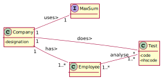
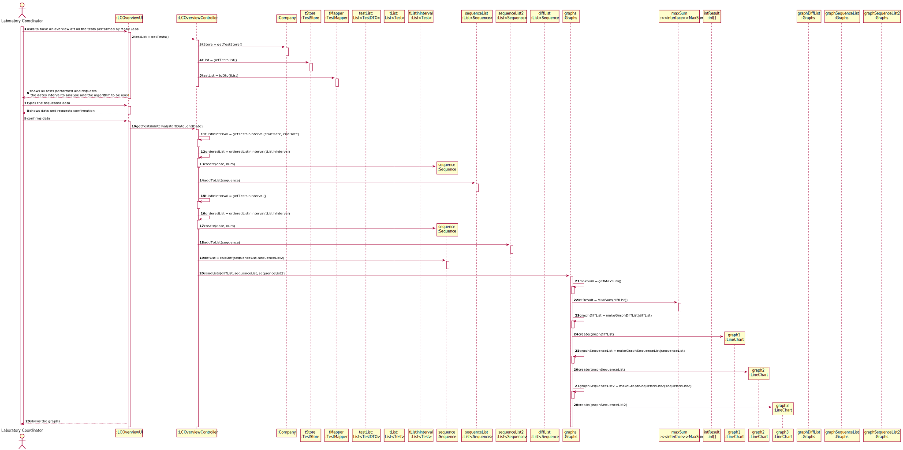

# US 016 - To overview all tests

## 1. Requirements Engineering

### 1.1. User Story Description

US16: As a laboratory coordinator, I want to have an overview of all the tests performed by Many Labs and analyse the overall performance of the company (for instance, check the sub-intervals in which there were more samples waiting for the result). To facilitate overall analysis, the application should also display statistics and graphs.

### 1.2. Customer Specifications and Clarifications 

**From the specifications document:**

> "At the same time the results are also available in the central application where the medical lab technicians who collect the samples, the clinical chemistry technologist, the specialist doctor, and the laboratory coordinator can check them."

**From the client clarifications:**

> **Question:** "Regarding US16, when the laboratory coordinator "analyses the overall performance of the company", is the analysis purely looking at the results? Or should he write any type of report based on the results for the interval he is seeing?"
>  
> **Answer:** "You should only identify the time interval where there was a delay in the response (the maximum subsequence)." - [link: https://moodle.isep.ipp.pt/mod/forum/discuss.php?d=8963]

> **Question:** "The elements used in the algorithm refer to a half-hour interval?"
>  
> **Answer:** "Yes." - [link: https://moodle.isep.ipp.pt/mod/forum/discuss.php?d=8964#p11898]

> **Question:** "Does the laboratory coordinator also select the amount of working hours per day? Or should we just consider it as 12 working hours/day?"
>  
> **Answer:** "The lab coordinator does not select the amount of working hours per day. Please consider 12 working hours per day." - [link: https://moodle.isep.ipp.pt/mod/forum/discuss.php?d=8959#p11887]

> **Question:** "If Saturday or Sunday are in the interval should we skip them or count them also as working days?"
>  
> **Answer:** " Sunday is not a working day. All the other days of the week are working days." - [link: https://moodle.isep.ipp.pt/mod/forum/discuss.php?d=8906#p11696]

> **Question:** "When referring to "the application should also display statistics and graphs" is it up to the team to decide which API or resource should be used to generate graphs and statistics, or do you prefer something specific?"
>  
> **Answer:** "With JavaFX you can draw high quality graphs and there is no need to use other tools." - [link: https://moodle.isep.ipp.pt/mod/forum/discuss.php?d=8869#p11682]

### 1.3. Acceptance Criteria

* **AC1:** While evaluating the performance the laboratory coordinator should have the ability to dynamically select the algorithm to be applied from the ones available on the system (the benchmark algorithm provided in moodle and the brute-force algorithm to be developed)
* **AC2:** Support for easily adding other similar algorithms is required

### 1.4. Found out Dependencies

* There is a dependency to "US012 ResultOfTest" since at least a test must had started analysing the samples.

### 1.5 Input and Output Data

**Input Data:**
	
* Selected data: Select the algorithm to use.

**Output Data:**

* (In)Success of the operation
* The graphs and statistics

### 1.6. System Sequence Diagram (SSD)

**Alternative 1**

### 1.7 Other Relevant Remarks

* The created task stays in a "not published" state in order to distinguish from "published" tasks.

## 2. OO Analysis

### 2.1. Relevant Domain Model Excerpt 

### 2.2. Other Remarks

n/a

## 3. Design - User Story Realization 

### 3.1. Rationale

**SSD - Alternative 1 is adopted.**

| Interaction ID | Question: Which class is responsible for...                     | Answer                        | Justification (with patterns)                                                                                                                                                                          |
|:-------------  |:--------------------------------------------------------------- |:-----------------------------:|:------------------------------------------------------------------------------------------------------------------------------------------------------------------------------------------------------ |
| Step 1  		 | ... interacting with the actor?                                 | RecordSampleUI                | **Pure Fabrication**: none of the domain models classes had the responsability of interactiong with the user.                                                                                          |
|                | ... coordinating the US?                                        | RecordSampleController        | **Controller**                                                                                                                                                                                         |
| Step 2  		 | ... knowing the tests to show?                                  | TestStore                     | **Information Expert**: Owns the existing tests.                                                                                                                                                       |
|                | ... knowing the test store                                      | Company                       | **Information Expert**: Knows the existing stores.                                                                                                                                                     |
|                | ... process the data and convert it to dto                      | TestMapper                    | **DTO**: So that the UI can't interact directly with the domain.                                                                                                                                       |
| Step 3  		 |                                                                 |                               |                                                                                                                                                                                                        |
| Step 4  		 |                                                                 |                               |                                                                                                                                                                                                        |
| Step 5  		 | ... knowing the number of samples?                              | Test                          |**Information Expert**: knowing how many samples were collected.                                                                                                                                        |
| 		         | ... instantiating a new Sample?                                 | Test                          | **Creator (R1)** and **HC+LC**: Applying the Creator (R1) would be in the "Company". But, by applying HC + LC to the "Company", this transfers the responsibility to the test class                    |
|        		 | ... validating all data (local validation)?                     | Sample                        | IE: owns its data.                                                                                                                                                                                     |
|        		 | ... validating all data (global validation)?                    | Test                          | IE: owns its data.                                                                                                                                                                                     |
|                | ... adapting the interface                                      | BarcodeAdapter                | **Protected variations**: Identify points of predicted variation or instability (variety of interfaces) and assign responsibilities (to the adapters) to create a stable interface around those points.|                                                                                             |
| Step 6  		 |                                                                 |                               |                                                                                                                                                                                                        |
| Step 7  		 | ... validating all data (global validation)?                    | Test                          | IE: owns its data.                                                                                                                                                                                     |
|                | ... saving the sample?                                          | Test                          | IE: Test know its own data                                                                                                                                                                             |
| Step 8  		 | ... informing operation success?                                | RecordSampleUI                | IE: is responsible for user interactions.                                                                                                                                                              |

### Systematization ##

According to the taken rationale, the conceptual classes promoted to software classes are: 

 * Sample
 * Test
 * Company
 

Other software classes (i.e. Pure Fabrication) identified: 

 * RecordSampleUI  
 * RecordSampleController
 * TestStore
 * TestMapper
 * BarcodeAdapter

## 3.2. Sequence Diagram (SD)

**Alternative 1**

## 3.3. Class Diagram (CD)

**From alternative 1**

# 4. Tests 

**Test 1:** Confirm if the barcode is correct 

	@Test
        public void getBarcode() throws BarcodeException, IllegalAccessException, ClassNotFoundException, InstantiationException, OutputException {
    
            Company c= new Company("ManyLabs");
            Client client = new Client(1234567890123456L,1234567890L,"12/12/2012","Male",1234567890L,"asd@gmail.com","Moirane",44123456789L);
    
            ParameterCategory pc = new ParameterCategory("hemogram", "09090");
    
            Parameter p = new Parameter("01981", "aa", "blood", pc);
            List<Parameter> param = new ArrayList<>();
    
            param.add(p);
    
            ParameterCategory pc1 = new ParameterCategory("Immunity", "11111");
            ParameterCategory pc2 = new ParameterCategory("Hemogram", "10019");
            c.getParameterCategoryStore().addToList(pc1);
            c.getParameterCategoryStore().addToList(pc2);
    
            List<ParameterCategory> listPC = new ArrayList<>();
            ParameterCategory pca = c.getParameterCategoryStore().getParameterCategoryByCode("10019");
    
            listPC.add(pca);
            TestType testesss = new TestType("asd","asd","12345",listPC);
    
            c.getTestTypeStore().addToList(testesss);
    
            LabOrder labOrder= new LabOrder(testesss,param);
    
            c.getLabOrderStore().addToList(labOrder);
    
            app.domain.model.Test nteste=new app.domain.model.Test(c, client,123412341200L,labOrder);
    
    
            c.getTestStore().addToList(nteste);
    
            Sample s = new Sample(c);
    
            nteste.addSample(s);
    
            List<app.domain.model.Test> samples = c.getTestStore().getTests();
    
            assertEquals("00000000001",s.getBarcode().getBarcodeNumber());
        }
	

**Test 2:** Check if sample equals to null 

	@Test
        public void testEqualsNull() throws BarcodeException, IllegalAccessException, ClassNotFoundException, InstantiationException, OutputException {
            Company c= new Company("ManyLabs");
            Company c2= new Company("ManyLabs2");
            Client client = new Client(1234567890123456L,1234567890L,"12/12/2012","Male",1234567890L,"asd@gmail.com","Moirane",44123456789L);
    
            ParameterCategory pc = new ParameterCategory("hemogram", "09090");
    
            Parameter p = new Parameter("01981", "aa", "blood", pc);
            List<Parameter> param = new ArrayList<>();
    
            param.add(p);
    
            ParameterCategory pc1 = new ParameterCategory("Immunity", "11111");
            ParameterCategory pc2 = new ParameterCategory("Hemogram", "10019");
            c.getParameterCategoryStore().addToList(pc1);
            c.getParameterCategoryStore().addToList(pc2);
    
            List<ParameterCategory> listPC = new ArrayList<>();
            ParameterCategory pca = c.getParameterCategoryStore().getParameterCategoryByCode("10019");
    
            listPC.add(pca);
            TestType testesss = new TestType("asd","asd","12345",listPC);
    
            c.getTestTypeStore().addToList(testesss);
    
            LabOrder labOrder= new LabOrder(testesss,param);
    
            c.getLabOrderStore().addToList(labOrder);
    
            app.domain.model.Test nteste=new app.domain.model.Test(c, client,123412341200L,labOrder);
    
    
            c.getTestStore().addToList(nteste);
    
    
            Sample s = new Sample(c);
    
            Sample s2 =null;
    
            assertNotEquals(s,s2);
    
        }

*It is also recommended to organize this content by subsections.* 

# 5. Construction (Implementation)

## Class RecordSampleController 

		public boolean createNewSample(SampleDTO dto) throws BarcodeException, IllegalAccessException, InstantiationException, ClassNotFoundException, OutputException {
                this.test=sampleMapper.toModel(dto,testStore);
                this.samp = this.test.RecordNewSample(company);
        
               return this.test.validateSample(samp,company );
        
            }

## Class Test

		public Sample RecordNewSample(Company c) throws BarcodeException, IllegalAccessException, ClassNotFoundException, InstantiationException, OutputException {
                return new Sample(c);
            }

# 6. Integration and Demo 

* A new option on the Employee menu options was added.

* Some demo purposes some tasks are bootstrapped while system starts.

# 7. Observations

Platform and Organization classes are getting too many responsibilities due to IE pattern and, therefore, they are becoming huge and harder to maintain. 

Is there any way to avoid this to happen?

