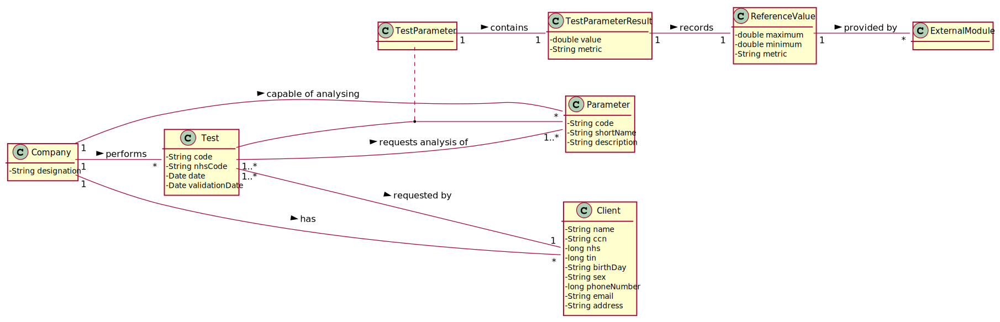
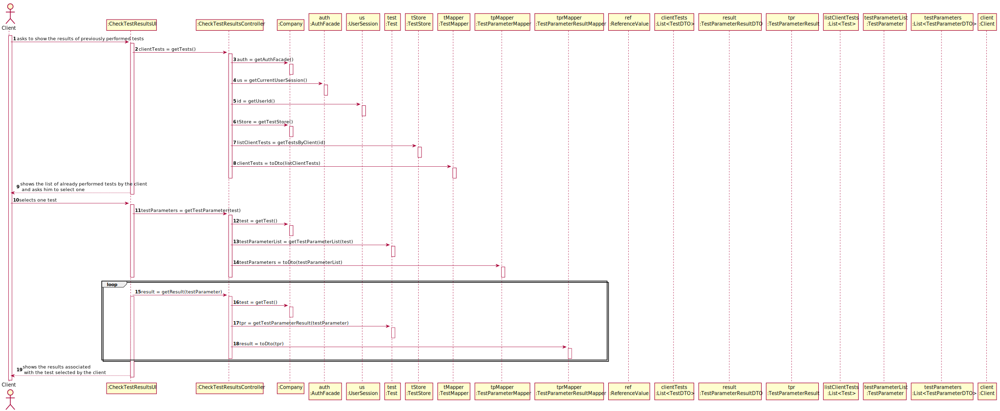

# US 001 - To view the result of tests

## 1. Requirements Engineering

### 1.1. User Story Description

As a client, I want to access the application to view the results of the tests I have performed.

### 1.2. Customer Specifications and Clarifications 

**From the specifications document:**

> "Once the laboratory coordinator confirms that everything was done correctly, the client receives a notification alerting that the results are already available in the central application and informing that he/she must access the application to view those results.".

**From the client clarifications:**

> **Question:** "In US01 which date should be used to arrange the tests in order? The date the test is done or the validation date?"
>  
> **Answer:** "The test registration date." - [link: https://moodle.isep.ipp.pt/mod/forum/discuss.php?d=8787]

> **Question:** "The test�s results show only present the parameters value or the analysis of those values?"
>  
> **Answer:** 

> **Question:** "My group is assuming that the client only wants to see the validated tests. Do you want to see tests in other states and if that's the case say the state of the test and show only the information available for that state?
>  
> **Answer:** "The client should only see tests that have already been validated." - [link: https://moodle.isep.ipp.pt/mod/forum/discuss.php?d=9162#p12106]

### 1.3. Acceptance Criteria

* **AC1:** The client tests must be shown ordered from the most recent to the oldest one.
* **AC2:** The test results are shown only after the client has selected a test.

### 1.4. Found out Dependencies

### 1.5 Input and Output Data

**Input Data:**
	

**Output Data:**

### 1.6. System Sequence Diagram (SSD)

**Alternative 1**

### 1.7 Other Relevant Remarks

* The created task stays in a "not published" state in order to distinguish from "published" tasks.

## 2. OO Analysis

### 2.1. Relevant Domain Model Excerpt 

### 2.2. Other Remarks

n/a

## 3. Design - User Story Realization 

### 3.1. Rationale

**SSD - Alternative 1 is adopted.**

| Interaction ID | Question: Which class is responsible for...                     | Answer                        | Justification (with patterns)                                                                                                                                                                          |
|:-------------  |:--------------------------------------------------------------- |:-----------------------------:|:------------------------------------------------------------------------------------------------------------------------------------------------------------------------------------------------------ |
| Step 1  		 | ... interacting with the actor?                                 | CheckTestResultsUI                | **Pure Fabrication**: none of the domain models classes had the responsability of interactiong with the user.                                                                                          |
|                | ... coordinating the US?                                        | CheckTestResultsController        | **Controller**                                                                                                                                                                                         |
| Step 2  		 | ... knowing the tests to show?                                  | TestStore                     | **Information Expert**: Owns the existing tests.                                                                                                                                                       |
|                | ... knowing the test store                                      | Company                       | **Information Expert**: Knows the existing stores.                                                                                                                                                     |
|                | ... process the data and convert it to dto                      | TestMapper                    | **DTO**: So that the UI can't interact directly with the domain.                                                                                                                                       |
| Step 3  		 |                                                                 |                               |                                                                                                                                                                                                        |
| Step 4  		 | ...storing the results.                                          | TestParameter                    | **Information Expert**: Owns the Results of itself.                                                                                                                                                                                                  |
|                | ... process the data and convert it to dto                      | TestMapper                         |   **DTO**: So that the UI can't interact directly with the domain.                                                                                                             |
|                | ... storing the test parameters                                 | Test                      |   **Information Expert**: Owns his own parameters.                        
### Systematization ##

According to the taken rationale, the conceptual classes promoted to software classes are: 

 * Test
 * Company
 * Test Parameter
 

Other software classes (i.e. Pure Fabrication) identified: 

 * CheckTestResultsUI  
 * CheckTestResultsController
 * TestStore
 * TestMapper

## 3.2. Sequence Diagram (SD)

**Alternative 1**

## 3.3. Class Diagram (CD)

**From alternative 1**

# 4. Tests 

**Test 1:** Confirm if the barcode is correct 

	@Test
        public void getBarcode() throws BarcodeException, IllegalAccessException, ClassNotFoundException, InstantiationException, OutputException {
    
            Company c= new Company("ManyLabs");
            Client client = new Client(1234567890123456L,1234567890L,"12/12/2012","Male",1234567890L,"asd@gmail.com","Moirane",44123456789L);
    
            ParameterCategory pc = new ParameterCategory("hemogram", "09090");
    
            Parameter p = new Parameter("01981", "aa", "blood", pc);
            List<Parameter> param = new ArrayList<>();
    
            param.add(p);
    
            ParameterCategory pc1 = new ParameterCategory("Immunity", "11111");
            ParameterCategory pc2 = new ParameterCategory("Hemogram", "10019");
            c.getParameterCategoryStore().addToList(pc1);
            c.getParameterCategoryStore().addToList(pc2);
    
            List<ParameterCategory> listPC = new ArrayList<>();
            ParameterCategory pca = c.getParameterCategoryStore().getParameterCategoryByCode("10019");
    
            listPC.add(pca);
            TestType testesss = new TestType("asd","asd","12345",listPC);
    
            c.getTestTypeStore().addToList(testesss);
    
            LabOrder labOrder= new LabOrder(testesss,param);
    
            c.getLabOrderStore().addToList(labOrder);
    
            app.domain.model.Test nteste=new app.domain.model.Test(c, client,123412341200L,labOrder);
    
    
            c.getTestStore().addToList(nteste);
    
            Sample s = new Sample(c);
    
            nteste.addSample(s);
    
            List<app.domain.model.Test> samples = c.getTestStore().getTests();
    
            assertEquals("00000000001",s.getBarcode().getBarcodeNumber());
        }
	

**Test 2:** Check if sample equals to null 

	@Test
        public void testEqualsNull() throws BarcodeException, IllegalAccessException, ClassNotFoundException, InstantiationException, OutputException {
            Company c= new Company("ManyLabs");
            Company c2= new Company("ManyLabs2");
            Client client = new Client(1234567890123456L,1234567890L,"12/12/2012","Male",1234567890L,"asd@gmail.com","Moirane",44123456789L);
    
            ParameterCategory pc = new ParameterCategory("hemogram", "09090");
    
            Parameter p = new Parameter("01981", "aa", "blood", pc);
            List<Parameter> param = new ArrayList<>();
    
            param.add(p);
    
            ParameterCategory pc1 = new ParameterCategory("Immunity", "11111");
            ParameterCategory pc2 = new ParameterCategory("Hemogram", "10019");
            c.getParameterCategoryStore().addToList(pc1);
            c.getParameterCategoryStore().addToList(pc2);
    
            List<ParameterCategory> listPC = new ArrayList<>();
            ParameterCategory pca = c.getParameterCategoryStore().getParameterCategoryByCode("10019");
    
            listPC.add(pca);
            TestType testesss = new TestType("asd","asd","12345",listPC);
    
            c.getTestTypeStore().addToList(testesss);
    
            LabOrder labOrder= new LabOrder(testesss,param);
    
            c.getLabOrderStore().addToList(labOrder);
    
            app.domain.model.Test nteste=new app.domain.model.Test(c, client,123412341200L,labOrder);
    
    
            c.getTestStore().addToList(nteste);
    
    
            Sample s = new Sample(c);
    
            Sample s2 =null;
    
            assertNotEquals(s,s2);
    
        }

*It is also recommended to organize this content by subsections.* 

# 5. Construction (Implementation)

## Class RecordSampleController 

		public boolean createNewSample(SampleDTO dto) throws BarcodeException, IllegalAccessException, InstantiationException, ClassNotFoundException, OutputException {
                this.test=sampleMapper.toModel(dto,testStore);
                this.samp = this.test.RecordNewSample(company);
        
               return this.test.validateSample(samp,company );
        
            }

## Class Test

		public Sample RecordNewSample(Company c) throws BarcodeException, IllegalAccessException, ClassNotFoundException, InstantiationException, OutputException {
                return new Sample(c);
            }

# 6. Integration and Demo 

* A new option on the Employee menu options was added.

* Some demo purposes some tasks are bootstrapped while system starts.

# 7. Observations

Platform and Organization classes are getting too many responsibilities due to IE pattern and, therefore, they are becoming huge and harder to maintain. 

Is there any way to avoid this to happen?

