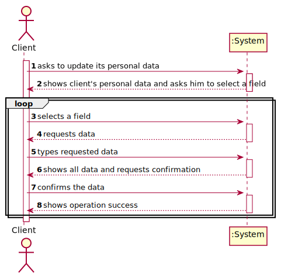
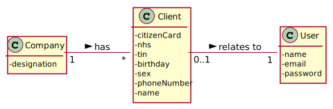
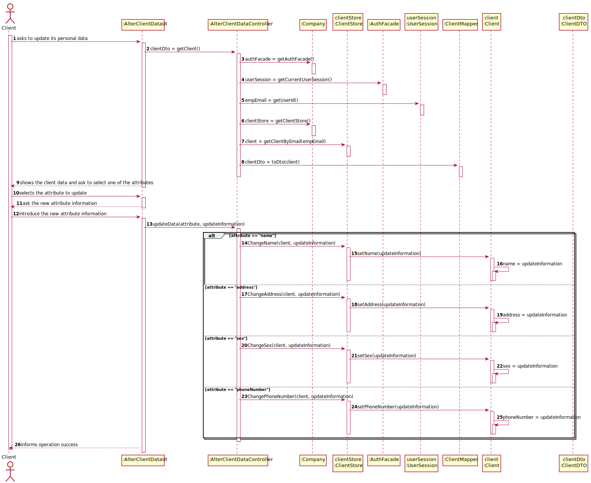
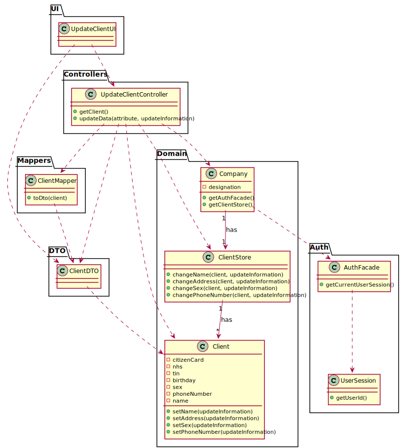

# US 002 - To update a Client 

## 1. Requirements Engineering

### 1.1. User Story Description

As a client, I want to update my personal data.

### 1.2. Customer Specifications and Clarifications 

**From the specifications document:**

**From the client clarifications:**

> **Question:** "Should the Client type in the attribute he/she wants to update or should he choose from a list?" [link - https://moodle.isep.ipp.pt/mod/forum/discuss.php?d=8838#p11541]
>  
> **Answer:** "In this sprint each team should develop a graphical user interface for US2. The application should show the current user data and the client can update any attribute."

-

> **Question:** "To update the attribute, should the Client type the previous data?" [link - https://moodle.isep.ipp.pt/mod/forum/discuss.php?d=8838#p11541]
>  
> **Answer:** "In this sprint each team should develop a graphical user interface for US2. The application should show the current user data and the client can update any attribute."

-

> **Question:** "What is the Data that the Client can update?" [link - https://moodle.isep.ipp.pt/mod/forum/discuss.php?d=8838#p11541]
>  
> **Answer:** "In this sprint each team should develop a graphical user interface for US2. The application should show the current user data and the client can update any attribute."

### 1.3. Acceptance Criteria

* **AC1** All fields are optional
* **AC2** Citizen Card: 16 digit number
* **AC3** NHS: 10 digit number
* **AC4** TIN: 10 digit number
* **AC5** Birth day - in which format: DD/MM/YY
* **AC6** Sex - should only be Male/Female or include more options. Male/Female
* **AC7** Phone number: 11 digit number
* **AC8** The client cant be older than 150 years
* **AC9** The name cant be longer than 35 characters

### 1.4. Found out Dependencies

* There is a dependency to "US03 To Register A Client" since the client must be registered in the system, to update its data.

### 1.5 Input and Output Data

**Input Data:**

* Typed data:
	* Sex,
	* Address,
	* Name,
	* Phone number.

**Output Data:**

* List of client information;
* (In)Success of the operation.

### 1.6. System Sequence Diagram (SSD)

**Alternative 1**

**Other alternatives might exist.**

### 1.7 Other Relevant Remarks

* The created task stays in a "not published" state in order to distinguish from "published" tasks.

## 2. OO Analysis

### 2.1. Relevant Domain Model Excerpt 

### 2.2. Other Remarks

n/a

## 3. Design - User Story Realization 

### 3.1. Rationale

**SSD - Alternative 1 is adopted.**

| Interaction ID | Question: Which class is responsible for... | Answer  | Justification (with patterns)  |
|:-------------  |:--------------------- |:------------|:---------------------------- |
| Step 1  		 |	... interacting with the actor? | :AlterClientDataUI   |  **Pure Fabrication**: there is no reason to assign this responsibility to any existing class in the Domain Model.           |
| 			  	|	... coordinating the US? | :AlterClientDataController |  **Controller**                            |
| Step 2  		 |	... knowing the clients data | Client             | **IE** Knows its own data                              |
|                |  ... knowing the store of clients | Client Store | **IE** Owns the existing clients      |
|                |  ... process the data and convert it to dto | ClientMapper | **DTO**  So that the UI can't interact directly with the domain. |
| Step 3  		 |	                                  |                              |                     |
| Step 4  		 |	                                   |                |             |
| Step 5  		 |	                                      |                             |           |
| Step 6  		 |  ... process the data and convert it to dto	 | ClientMapper        |  **DTO**  So that the UI can't interact directly with the domain.                             |              
| Step 7  		 |	... validating all data (local validation)? | Client | IE: owns its data.| 
| 			     |	... validating all data (global validation)? | Client Store | IE: knows all the clients.| 
| 			     |	... saving the changes? | Client | IE: owns its data.| 
| Step 8  		 |	... informing operation success?| AlterClientDataUI  | IE: is responsible for user interactions.  | 

### Systematization ##

According to the taken rationale, the conceptual classes promoted to software classes are: 

 * Client

Other software classes (i.e. Pure Fabrication) identified: 

 * AlterClientDataUI  
 * AlterClientDataController
 * Client Store
 * Client Mapper

## 3.2. Sequence Diagram (SD)

**Alternative 1**

## 3.3. Class Diagram (CD)

**From alternative 1**

# 4. Tests 

**Test 1:** Check that it is not possible to create an instance of the Task class with null values. 

	@Test(expected = IllegalArgumentException.class)
		public void ensureNullIsNotAllowed() {
		Task instance = new Task(null, null, null, null, null, null, null);
	}
	

**Test 2:** Check that it is not possible to create an instance of the Task class with a reference containing less than five chars - AC2. 

	@Test(expected = IllegalArgumentException.class)
		public void ensureReferenceMeetsAC2() {
		Category cat = new Category(10, "Category 10");
		
		Task instance = new Task("Ab1", "Task Description", "Informal Data", "Technical Data", 3, 3780, cat);
	}

*It is also recommended to organize this content by subsections.* 

# 5. Construction (Implementation)

## Class CreateTaskController 

		public boolean createTask(String ref, String designation, String informalDesc, 
			String technicalDesc, Integer duration, Double cost, Integer catId)() {
		
			Category cat = this.platform.getCategoryById(catId);
			
			Organization org;
			// ... (omitted)
			
			this.task = org.createTask(ref, designation, informalDesc, technicalDesc, duration, cost, cat);
			
			return (this.task != null);
		}

## Class Organization

		public Task createTask(String ref, String designation, String informalDesc, 
			String technicalDesc, Integer duration, Double cost, Category cat)() {
		
	
			Task task = new Task(ref, designation, informalDesc, technicalDesc, duration, cost, cat);
			if (this.validateTask(task))
				return task;
			return null;
		}

# 6. Integration and Demo 

* A new option on the Employee menu options was added.

* Some demo purposes some tasks are bootstrapped while system starts.

# 7. Observations

Platform and Organization classes are getting too many responsibilities due to IE pattern and, therefore, they are becoming huge and harder to maintain. 

Is there any way to avoid this to happen?

